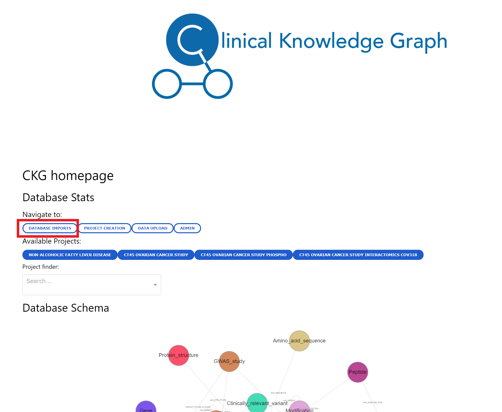

Clinical Knowledge Graph Statistics: Imports
============================================

Everytime you perform a :ref:`full` or :ref:`partial` of any of the ontologies or databases, CKG will register the number of nodes and relationships imported (parsed into tsv files).
When importing ontologies or databases, each parser will return ``stats``, which is a `Pandas dataframe <https://pandas.pydata.org/pandas-docs/stable/reference/api/pandas.DataFrame.html>`__ with the total number of nodes and relationships extracted from the ontology or database source and details about the time when the imoport happened or the disk space occupied by the generated file.

The columns in the ``stats`` dataframe are:

- date: import date
- time: import time
- dataset: name ontology or database
- filename: name of the file containing the nodes or relationships
- file_size: size of the file
- Imported_number: number of nodes or relationships
- Import_type: nodes (entity) or relationships
- name: node or relationship type
- updated_on: date when it was downloaded
- import_id: unique id import

This dataframe is stored in the `data/stats` directory as a Hierarchical Data Format file (HDF5) and can be read directly from pandas:

.. code-block:: python

    import pandas as pd

    stats_file = 'data/stats/stats.hdf'

    df = pd.read_hdf(stats_file)

    df.head()

    
+-----------+---------+----------+---------------------------------------------+-----------+-----------------+---------------+-------------------------------+------------+--------------------------------------+
| date      | time    | dataset  | filename                                    | file_size | Imported_number | Import_type   | name                          | updated_on | import_id                            |
+-----------+---------+----------+---------------------------------------------+-----------+-----------------+---------------+-------------------------------+------------+--------------------------------------+
| 2021-5-26 | 8:46:8  | drugbank | databases\Drug.tsv                          | 14524554  | 14315           | entity        | Drug                          | 2021-05-26 | dc0cd359-e8db-4776-b881-42ef92b5a374 |
+-----------+---------+----------+---------------------------------------------+-----------+-----------------+---------------+-------------------------------+------------+--------------------------------------+
| 2021-5-26 | 8:46:16 | drugbank | databases\drugbank_interacts_with_drug.tsv  | 374457897 | 2682157         | relationships | drugbank_interacts_with_drug  | 2021-05-26 | dc0cd359-e8db-4776-b881-42ef92b5a374 |
+-----------+---------+----------+---------------------------------------------+-----------+-----------------+---------------+-------------------------------+------------+--------------------------------------+
| 2021-5-26 | 8:46:8  | drugbank | databases\drugbank_annotated_in_pathway.tsv | 185248    | 3780            | relationships | drugbank_annotated_in_pathway | 2021-05-26 | dc0cd359-e8db-4776-b881-42ef92b5a374 |
+-----------+---------+----------+---------------------------------------------+-----------+-----------------+---------------+-------------------------------+------------+--------------------------------------+
| 2021-5-26 | 8:46:8  | drugbank | databases\drugbank_targets_protein.tsv      | 595700    | 14890           | relationships | drugbank_targets_protein      | 2021-05-26 | dc0cd359-e8db-4776-b881-42ef92b5a374 |
+-----------+---------+----------+---------------------------------------------+-----------+-----------------+---------------+-------------------------------+------------+--------------------------------------+

Also, you can visualize these statistics in different plots as part of CKG app, just navigate to `Data imports`: 

.. image:: ../_static/images/database_imports_app.png
    :width: 48%

In this web app, you will access a report with statistics such as:

- Number of imported nodes (entities) and relationships by date/time

- Number of imported nodes (entities) and relationships by date/time per ontology/database

- File sizes for nodes and relationships

- All stats for each node type and relationship per database

These statistics are quite relevant to follow the progress of the knowledge graph and also a good way to compare the current import of an ontology or a database with respect to previous updates.

.. note:: We recommend monitoring these statistics to identify possible issues when updating CKG.

