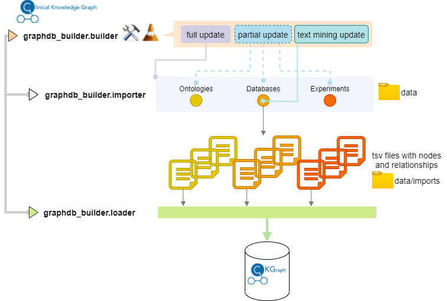
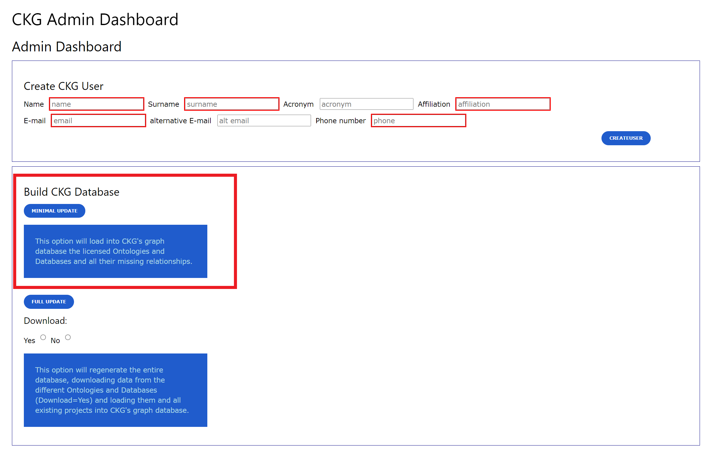
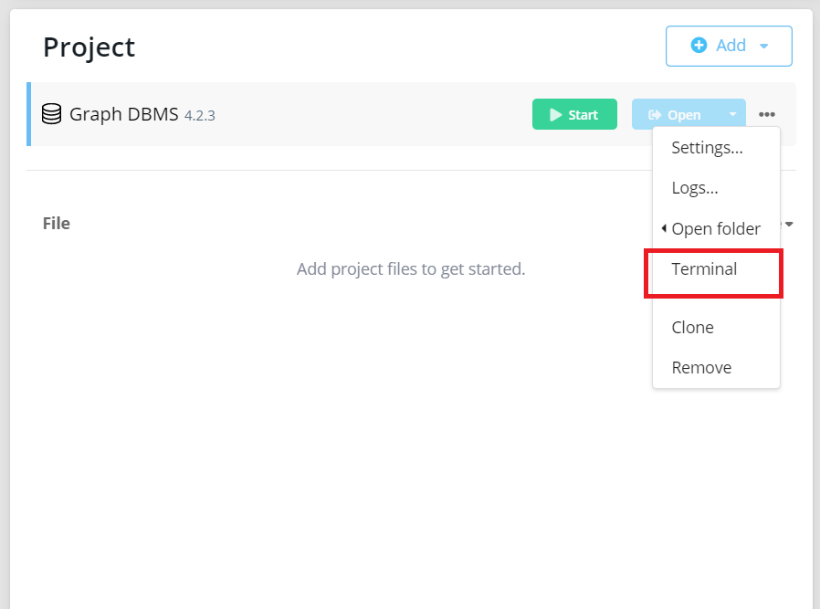
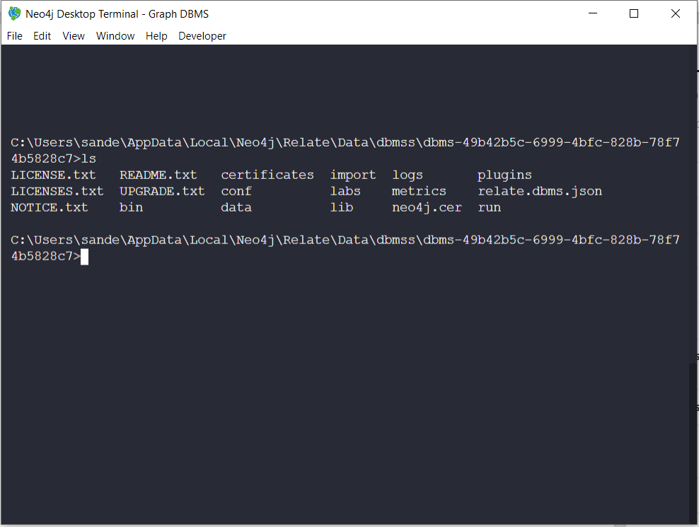

##############################
Building CKG's Graph Database
##############################

CKG has a dedicated module (graphdb_builder) that can be used to generate the entire Knowledge Graph (full update) or to update specific ontologies, databases or experiments (partial update).
The module works as a 2-step process:

1) Import:
   uses specific parsers and configuration files to convert `ontologies <https://github.com/MannLabs/CKG/tree/master/ckg/graphdb_builder/ontologies>`__, `databases <https://github.com/MannLabs/CKG/tree/master/ckg/graphdb_builder/databases>`__ and `experimental data (projects) <https://github.com/MannLabs/CKG/tree/master/ckg/graphdb_builder/experiments>`__ into tab-separated values files with the entities (nodes) and relationships to be imported into the graph database. The generated files are stored in the `data/imports` directory.

2) Loading: 
   When loading data into the graph, we need to specify the type of node (entity) to be loaded. The types of nodes correspond to the defined data model:
   
    .. image:: ../_static/images/data_model.png
        :width: 100%
        :align: center

    
   The list of entities to be loaded into the graph is defined in the `builder configuration file <https://github.com/MannLabs/CKG/blob/master/ckg/graphdb_builder/builder/builder_config.yml>`__ under graph.  
   
   CKG has predefined `Cypher queries <https://github.com/MannLabs/CKG/blob/master/ckg/graphdb_builder/builder/cypher.yml>`__ to load the generated tsv files into the graph database. To facilitate the use and understanding of the queries, they are defined in YAML format, which allows to define attributes such as query name, description, nodes and relationships involved.

.. warning:: Remember that the graph database needs to be running when the database is being built or updated (Loading step).

.. _licenced databases:

Licensed Databases
=======================

Most of the biomedical databases and ontology files will automatically be downloaded during building of the database. However, the following licensed databases have to be downloaded manually.

.. figure:: ../_static/images/psp_folder.png
    :width: 210px
    :align: left

    PhosphoSitePlus database folder.

.. figure:: ../_static/images/drugbank_folder.png
    :width: 210px
    :align: left

    DrugBank database folder.

.. figure:: ../_static/images/snomed_folder.png
    :width: 210px
    :align: left

    SNOMED-CT ontology folder.

- `PhosphoSitePlus <https://www.phosphosite.org/staticDownloads>`__: *Acetylation_site_dataset.gz*, *Disease-associated_sites.gz*, *Kinase_Substrate_Dataset.gz*, *Methylation_site_dataset.gz*, *O-GalNAc_site_dataset.gz*, *O-GlcNAc_site_dataset.gz*, *Phosphorylation_site_dataset.gz*, *Regulatory_sites.gz*, *Sumoylation_site_dataset.gz* and *Ubiquitination_site_dataset.gz*.

- `DrugBank <https://www.drugbank.ca/releases/latest>`__: *All drugs* (under *COMPLETE DATABASE*) and *DrugBank Vocabulary* (under *OPEN DATA*).

- `SNOMED-CT <https://www.nlm.nih.gov/healthit/snomedct/international.html>`__: *Download RF2 Files!*.

.. _folders:

After download, move the files to their respective folders:

- PhosphoSitePlus: ``CKG/data/databases/PhosphoSitePlus``
- DrugBank: ``CKG/data/databases/DrugBank``
- SNOMED-CT: ``CKG/data/ontologies/SNOMED-CT``

In the case of SNOMED-CT, unzip the downloaded file and copy all the subfolders and files to the ``SNOMED-CT`` folder.

.. warning:: These three databases require login and authentication. To sign up go to `PSP Sign up <https://www.phosphosite.org/signUpAction>`__, `DrugBank Sign up <https://www.drugbank.ca/public_users/sign_up>`__ and `SNOMED-CT Sign up <https://uts.nlm.nih.gov/license.html>`__. In the case of SNOMED-CT, the UMLS license can take several business days.

.. note:: If the respective database folder is not created, please do it manually.

Graph Database Builder
=======================

.. _full:

Full update
^^^^^^^^^^^^

The full update goes through both steps (import and loading) and updates all ontologies, databases and the available experiments. There are several options to run the full update:

**1) Command-line (executable)** *(Recommended)*

.. code-block:: bash

    $ ckg_build

This will initiate the full update with default parameters:

- `download=True` -- ontologies and databases will be downloaded from their sources

- `n_jobs=3` -- 3 processes will be use simultaneously

**2) Command-line (programmatically)**
   
The module `graphdb_builder/builder/builder.py <https://github.com/MannLabs/CKG/blob/master/ckg/graphdb_builder/builder/builder.py>`__ can be called as a python script in the command-line. Use `-h` to get help on how to use it:

.. code-block:: bash

    $ python builder.py -h
    
        usage: builder.py [-h] [-b {import,load,full,minimal}]
                [-i {experiments,databases,ontologies,users} [{experiments,databases,ontologies,users} ...]]
                [-l LOAD_ENTITIES [LOAD_ENTITIES ...]] [-d DATA [DATA ...]]
                [-s SPECIFIC [SPECIFIC ...]] [-n N_JOBS] [-w DOWNLOAD] -u
                USER

        optional arguments:
        -h, --help            show this help message and exit
        -b {import,load,full,minimal}, --build_type {import,load,full,minimal}
                                define the type of build you want (import, load, full
                                or minimal (after dump file))
        -i {experiments,databases,ontologies,users} [{experiments,databases,ontologies,users} ...], --import_types {experiments,databases,ontologies,users} [{experiments,databases,ontologies,users} ...]
                                If only import, define which data types (ontologies,
                                experiments, databases, users) you want to import
                                (partial import)
        -l LOAD_ENTITIES [LOAD_ENTITIES ...], --load_entities LOAD_ENTITIES [LOAD_ENTITIES ...]
                                If only load, define which entities you want to load
                                into the database (partial load)
        -d DATA [DATA ...], --data DATA [DATA ...]
                                If only import, define which ontology/ies,
                                experiment/s or database/s you want to import
        -s SPECIFIC [SPECIFIC ...], --specific SPECIFIC [SPECIFIC ...]
                                If only loading, define which ontology/ies, projects
                                you want to load
        -n N_JOBS, --n_jobs N_JOBS
                                define number of cores used when importing data
        -w DOWNLOAD, --download DOWNLOAD
                                define whether or not to download imported data
        -u USER, --user USER  Specify a user name to keep track of who is building
                                the database

For a full update:

.. code-block:: bash

    $ python builder.py --build_type full --download True --user ckg_user

**3) Admin page (CKG app)**

In CKG's app, the `Admin page` provides as well the option to start a full update of the database.

.. image:: ../_static/images/admin_update.png
    :width: 100%
    :align: center

.. warning:: This option takes longer than the command-line options because multi-processing is not possible.

.. _partial:

Partial update
^^^^^^^^^^^^^^^

If you want to update a specific ontology, database or project, you can use the partial update functionality in graphdb_builder. The partial update is done programmatically only and you will need to define which ontologies or databases names, or project identifiers to update.
The ontologies and databases that are available to import can be checked in the configuration files: `ontologies_config.yml <https://github.com/MannLabs/CKG/blob/master/ckg/graphdb_builder/ontologies/ontologies_config.yml>`__ under `ontologies` and `databases_config.yml <https://github.com/MannLabs/CKG/blob/master/ckg/graphdb_builder/databases/databases_config.yml>`__ under `databases`.
The partial update is again a 2-step process, so you will need to import the ontologies/databases/projects and then load them into the graph. 

For instance, to update the Disease Ontology:

    .. code-block:: bash

        $ python builder.py --build_type import --import_types ontologies --data disease --download True --user ckg_user
        $ python builder.py --build_type load --load_entities ontologies --specific disease --user ckg_user

To update a database:

    .. code-block:: bash

        $ python builder.py --build_type import --import_types databases --data HMDB --download True --user ckg_user
        $ python builder.py --build_type load --load_entities metabolite --user ckg_user

.. _minimal update:

Minimal update
^^^^^^^^^^^^^^^

To easily have CKG up and running we provide a database dump that can be easily uploaded following :ref:`dump file`.
However, as mentioned before licensed databases and ontologies are not provided in this dump file and you will need to apply for access to get them into CKG's graph database. 
When you get access to these data, you download them and store them into the right data folders (:ref:`folders`). Together with the dump file, you can download a folder with ``data.tar.gz``, which contains relationships from existing nodes in the database
to nodes created from the licensed databases (i.e. (:Drug)-[:HAS_SIDE_EFFECT]-(:Phenotype)). Unzip the contents in ``CKG/data/`` so that the ``data`` folder looks like the figure depicted.

.. figure:: ../_static/images/data_folder.png
	:width: 240px
	:align: right

	Final CKG/data folder architecture.

Afterwards, you can run the minimal update, which will parse these databases and ontology and generate the missing nodes and relationships in the database.

.. code-block::
    
    $ cd CKG/ckg/graphdb_builder/builder
    $ python builder.py -b minimal -u username

The Minimal update can be also done through the Admin page in CKG app.

Text mining update
^^^^^^^^^^^^^^^^^^^^

The text mining results in CKG are collected from the `Jensen Lab download page <https://download.jensenlab.org/>`__ and are generated using the `tagger tool <https://github.com/larsjuhljensen/tagger>`__. 
CKG collects the relevant `textmining_mentions files` (human, chemicals, diseases, tissues, etc) and parses them to obtain edgelists of protein-publication, drug-publication or disease-publication associations among other that can be loaded into the knowledge graph.
These files are updated in a weekly basis, and given the number of open access publications made available in a week, it may be convinient to update the Knowledge Graph also with certain periodicity.
For that, you can use the functionality ``ckg_update_textmining`` paired with a task scheduler to update the textmining results from the Jensen lab (https://jensenlab.org/).

To run the text mining update:

.. code-block:: bash

    $ cd CKG
    $ conda activate NAME_OF_YOUR_ENVIRONMENT
    $ ckg_update_textmining

This will start a partial update of the Publication nodes and their relationships to other entities: tissues, diseases, proteins, etc. The update takes a while but can run in the background.

.. _dump file:

Building CKG's Graph Database from a Dump File
=================================================

A dump file of the database is also made available in this `link <https://data.mendeley.com/datasets/mrcf7f4tc2/1>`__ and alternatively, you can use it to load the graph database contained in it. 
To do so, download both files (``ckg_190521_neo4j_4.2.3.dump`` and ``data.tar.gz``).

The ``.dump`` file will be used to load the Neo4j graph database:

If you have Neo4j desktop installed, you can use Neo4j terminal to access the path where the database is installed.

	How to get the Neo4j terminal.

	Neo4j terminal.

1. Create ``backups`` and ``graph.db`` folders:

.. code-block:: bash

	$ mkdir backups
	$ mkdir backups/graph.db
	$ cp ckg_190521_neo4j_4.2.3.dump backups/graph.db/.

1. After copying the dump file to backups/graph.db/, make sure the graph database is shutdown and run:

.. code-block:: bash

	$ bin/neo4j-admin load --from=backups/graph.db/ckg_190521_neo4j_4.2.3.dump --database=graph.db --force

In some systems you might have to run this as root:

.. code-block:: bash

	$ sudo bin/neo4j-admin load --from=backups/graph.db/ckg_080520.dump --database=graph.db --force
	$ sudo chown -R username data/databases/graph.db/

.. warning:: Make sure the dump file naming in the command above, matches the one provided to you.

.. note:: More information about restoring a database dump at `Neo4j docs <https://neo4j.com/docs/operations-manual/current/backup-restore/restore-dump/>`_.

3. Once you are done, start the database and you will have a functional graph database.

More on the dump file
^^^^^^^^^^^^^^^^^^^^^^^^^

Another great use for the dump file, is to generate backups of the database (e.g. different versions of the imported biomedical databases).
To generate a dump file of a specific Neo4j database, simply run:

.. code-block:: bash

	$ cd /path/to/neo4jDatabases/database-identifier/installation-x.x.x/
	$ bin/neo4j-admin dump --database=neo4j --to=backups/graph.db/name_of_the_file.dump

.. warning:: Remember to replace ``name_of_the_file`` with the name of the dump file you want to create.
