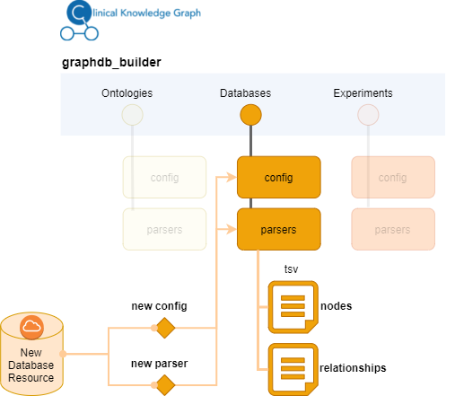

#####################
Adding New Resources
#####################

The Clinical Knowledge Graph can be easily extended to include new ontologies, databases or experimental data types.
The Graph Database Builder module (`graphdb_builder.py`) was built to quickly adapt the graph database data model to incorporate new nodes and relationships.
For that, the data integrated from a new resouce into the graph is generated from parsers.

A **parser** is a script that interprets the content provided by the new resource, and translates it into a format that CKG can load into the database (nodes and relationships).
In CKG node files define a table with a column named generally `ID` with a unique identifier for the node (i.e Gene Ontology identifier) and the rest of the columns are attributes of the node (i.e name or description). The relationship files define edge lists, that is, data structure used to represent a graph as a list of its edges.
In these files, one column identifies one node (i.e START_ID) and another the node connected to it (i.e END_ID). The rest of the columns define attributes of the relationship (i.e score or type).

**Node file example**

+--------------+-----------------+---------------------------------------+---------------------------------------------------------------------------------------------------------------------------------------------------------------------------------------------------------------------------------------------------------------------------------------------------------------------------------------------+--------+-------------------------------------------------------------------------------------------------------------------------------------------------------------------+
| "ID"         | ":LABEL"        | "name"                                | "description"                                                                                                                                                                                                                                                                                                                               | "type" | "synonyms"                                                                                                                                                        |
+--------------+-----------------+---------------------------------------+---------------------------------------------------------------------------------------------------------------------------------------------------------------------------------------------------------------------------------------------------------------------------------------------------------------------------------------------+--------+-------------------------------------------------------------------------------------------------------------------------------------------------------------------+
| "GO:0000001" | "Gene_ontology" | "mitochondrion inheritance"           | "The distribution of mitochondria, including the mitochondrial genome, into daughter cells after mitosis or meiosis, mediated by interactions between mitochondria and the cytoskeleton. [GOC:mcc, PMID:10873824, PMID:11389764]"                                                                                                           | "-21"  | "mitochondrion inheritance,mitochondrial inheritance"                                                                                                             |
+--------------+-----------------+---------------------------------------+---------------------------------------------------------------------------------------------------------------------------------------------------------------------------------------------------------------------------------------------------------------------------------------------------------------------------------------------+--------+-------------------------------------------------------------------------------------------------------------------------------------------------------------------+
| "GO:0000002" | "Gene_ontology" | "mitochondrial genome maintenance"    | "The maintenance of the structure and integrity of the mitochondrial genome; includes replication and segregation of the mitochondrial chromosome. [GOC:ai, GOC:vw]"                                                                                                                                                                        | "-21"  | "mitochondrial genome maintenance"                                                                                                                                |
+--------------+-----------------+---------------------------------------+---------------------------------------------------------------------------------------------------------------------------------------------------------------------------------------------------------------------------------------------------------------------------------------------------------------------------------------------+--------+-------------------------------------------------------------------------------------------------------------------------------------------------------------------+
| "GO:0000003" | "Gene_ontology" | "reproduction"                        | "The production of new individuals that contain some portion of genetic material inherited from one or more parent organisms. [GOC:go_curators, GOC:isa_complete, GOC:jl, ISBN:0198506732]"                                                                                                                                                 | "-21"  | "reproduction,reproductive physiological process,Wikipedia:Reproduction"                                                                                          |
+--------------+-----------------+---------------------------------------+---------------------------------------------------------------------------------------------------------------------------------------------------------------------------------------------------------------------------------------------------------------------------------------------------------------------------------------------+--------+-------------------------------------------------------------------------------------------------------------------------------------------------------------------+
| "GO:0000011" | "Gene_ontology" | "vacuole inheritance"                 | "The distribution of vacuoles into daughter cells after mitosis or meiosis, mediated by interactions between vacuoles and the cytoskeleton. [GOC:mcc, PMID:10873824, PMID:14616069]"                                                                                                                                                        | "-21"  | "vacuole inheritance"                                                                                                                                             |
+--------------+-----------------+---------------------------------------+---------------------------------------------------------------------------------------------------------------------------------------------------------------------------------------------------------------------------------------------------------------------------------------------------------------------------------------------+--------+-------------------------------------------------------------------------------------------------------------------------------------------------------------------+
| "GO:0000012" | "Gene_ontology" | "single strand break repair"          | "The repair of single strand breaks in DNA. Repair of such breaks is mediated by the same enzyme systems as are used in base excision repair. [PMID:18626472]"                                                                                                                                                                              | "-21"  | "single strand break repair"                                                                                                                                      |
+--------------+-----------------+---------------------------------------+---------------------------------------------------------------------------------------------------------------------------------------------------------------------------------------------------------------------------------------------------------------------------------------------------------------------------------------------+--------+-------------------------------------------------------------------------------------------------------------------------------------------------------------------+

**Relationship file example**

+--------------+--------------+--------------+---------------------------------------------------------------------------------------------------------------------------------------------------------------------------------------------------------------------------------------------------------------------------------------------------------------------------------------------+--------+-------------------------------------------------------------------------------------------------------------------------------------------------------------------+
| "START_ID"   | "END_ID"     | "TYPE"       | "description"                                                                                                                                                                                                                                                                                                                               | "type" | "synonyms"                                                                                                                                                        |
+--------------+--------------+--------------+---------------------------------------------------------------------------------------------------------------------------------------------------------------------------------------------------------------------------------------------------------------------------------------------------------------------------------------------+--------+-------------------------------------------------------------------------------------------------------------------------------------------------------------------+
| "GO:0072116" | "GO:0048645" | "HAS_PARENT" | "The distribution of mitochondria, including the mitochondrial genome, into daughter cells after mitosis or meiosis, mediated by interactions between mitochondria and the cytoskeleton. [GOC:mcc, PMID:10873824, PMID:11389764]"                                                                                                           | "-21"  | "mitochondrion inheritance,mitochondrial inheritance"                                                                                                             |
+--------------+--------------+--------------+---------------------------------------------------------------------------------------------------------------------------------------------------------------------------------------------------------------------------------------------------------------------------------------------------------------------------------------------+--------+-------------------------------------------------------------------------------------------------------------------------------------------------------------------+
| "GO:0046284" | "GO:0046275" | "HAS_PARENT" | "The maintenance of the structure and integrity of the mitochondrial genome; includes replication and segregation of the mitochondrial chromosome. [GOC:ai, GOC:vw]"                                                                                                                                                                        | "-21"  | "mitochondrial genome maintenance"                                                                                                                                |
+--------------+--------------+--------------+---------------------------------------------------------------------------------------------------------------------------------------------------------------------------------------------------------------------------------------------------------------------------------------------------------------------------------------------+--------+-------------------------------------------------------------------------------------------------------------------------------------------------------------------+
| "GO:0009238" | "GO:0009712" | "HAS_PARENT" | "The production of new individuals that contain some portion of genetic material inherited from one or more parent organisms. [GOC:go_curators, GOC:isa_complete, GOC:jl, ISBN:0198506732]"                                                                                                                                                 | "-21"  | "reproduction,reproductive physiological process,Wikipedia:Reproduction"                                                                                          |
+--------------+--------------+--------------+---------------------------------------------------------------------------------------------------------------------------------------------------------------------------------------------------------------------------------------------------------------------------------------------------------------------------------------------+--------+-------------------------------------------------------------------------------------------------------------------------------------------------------------------+
| "GO:0003219" | "GO:0003211" | "HAS_PARENT" | "The distribution of vacuoles into daughter cells after mitosis or meiosis, mediated by interactions between vacuoles and the cytoskeleton. [GOC:mcc, PMID:10873824, PMID:14616069]"                                                                                                                                                        | "-21"  | "vacuole inheritance"                                                                                                                                             |
+--------------+--------------+--------------+---------------------------------------------------------------------------------------------------------------------------------------------------------------------------------------------------------------------------------------------------------------------------------------------------------------------------------------------+--------+-------------------------------------------------------------------------------------------------------------------------------------------------------------------+
| "GO:0071385" | "GO:0051384" | "HAS_PARENT" | "The repair of single strand breaks in DNA. Repair of such breaks is mediated by the same enzyme systems as are used in base excision repair. [PMID:18626472]"                                                                                                                                                                              | "-21"  | "single strand break repair"                                                                                                                                      |
+--------------+--------------+--------------+---------------------------------------------------------------------------------------------------------------------------------------------------------------------------------------------------------------------------------------------------------------------------------------------------------------------------------------------+--------+-------------------------------------------------------------------------------------------------------------------------------------------------------------------+

The files and format provided by the different resources are not always as standard or stable as we would like (:ref:`see note <note tests>`). For that reason, CKG uses **configuration** files to define things like: resource's url, columns to be extracted, files to be generated and columns to be stored.
For example, the configuration file for the `STRING and STITCH databases <https://github.com/MannLabs/CKG/blob/master/ckg/graphdb_builder/databases/config/stringConfig.yml>`__ is:

.. code-block:: yaml

    ###### STRING database #######
    STRING_cutoff: 0.4

    STRING_mapping_url: 'https://stringdb-static.org/download/protein.aliases.v11.0/9606.protein.aliases.v11.0.txt.gz'
    STITCH_mapping_url: 'http://stitch.embl.de/download/chemical.aliases.v5.0.tsv.gz'

    STITCH_url: 'http://stitch.embl.de/download/protein_chemical.links.detailed.v5.0/9606.protein_chemical.links.detailed.v5.0.tsv.gz'
    STRING_url: 'https://stringdb-static.org/download/protein.links.detailed.v11.0/9606.protein.links.detailed.v11.0.txt.gz'

    STRING_actions_url: 'https://stringdb-static.org/download/protein.actions.v11.0/9606.protein.actions.v11.0.txt.gz'
    STITCH_actions_url: 'http://stitch.embl.de/download/actions.v5.0/9606.actions.v5.0.tsv.gz'

    header: 
        - 'START_ID'
        - 'END_ID'
        - 'TYPE'
        - 'interaction_type'
        - 'source'
        - 'evidence'
        - 'scores'
        - 'score'

    header_actions: 
        - 'START_ID'
        - 'END_ID'
        - 'TYPE'
        - 'action'
        - 'directionality'
        - 'score'
        - 'source'

Here, we specify the urls where to get the data from, and the headers in the resulting tsv files (relationships: interacts_with, acts_on).

When you want to add a new resouce, we recommend you to define first how this will impact the existing data model. For instance, try to answer the following questions:

- Are you adding new information or complementing existing resources? if complemnenting, what's the overlap between the different sources? 
- What types of clinical/biological questions would you like to answer with the new data?
- Will the update create new node types? What's the preferred ontology/terminology for such node type?
- How will the new data be integrated in the existing data model (connectivity)?
- What relationship types will you integrate? What attributes could be useful/relevant?

.. _note tests:

.. note:: To simplify the maintenance of parsers, we created unit tests to validate the existing urls for the resources integrated in CKG (`graphdb_builder test <https://github.com/MannLabs/CKG/blob/master/tests/test_graphdb_builder.py>`__).

Adding a New Resource: Ontology or Database
^^^^^^^^^^^^^^^^^^^^^^^^^^^^^^^^^^^^^^^^^^^^

To add a new database, you will first need to identify how to obtain the data. If available, we recommend downloading the data in text format directly from the resource. In the case of Ontologies, use the `Open Biological and Biomedical Ontologies format  <https://en.wikipedia.org/wiki/OBO_Foundry#The_OBO_file_format>`__.
Once idenitified the url where to obtain the data, you can start defining the **configuration** file. Then, you will need to understand the format of the data, what information can be retrieved and whether it can be associated to the new nodes or to the relationships created.
The next step will be to define how the resulting tsv files should look like. Implement the parser
according to this by extracting the data from the original format and translate them into what the output files should look like. We recommend use as template some of the existing parsers. Whenever possible use the **configuration** file to define variables that may need to be changed at some point such as for instance ulrs, cutoffs,
lists of columns, etc.

Include the **configuration** and the new **parser** files into the right graphdb_builder directory (ontologies, databases). Ontlogies work in slightly different way, because they generally follow a standard format (obo)
all the configuration is defined in the general configuration file (`ontologies_config.yml <https://github.com/MannLabs/CKG/blob/master/ckg/graphdb_builder/ontologies/ontologies_config.yml>`__). **Databases will need a specific configuration file.**

Example: Adding a new database resource

To make the new resource available:

1) Include the new resource in the list of ontologies or databases defined in the general configuration files, `ontologies_config.yml <https://github.com/MannLabs/CKG/blob/master/ckg/graphdb_builder/ontologies/ontologies_config.yml>`__ or `databases_config.yml <https://github.com/MannLabs/CKG/blob/master/ckg/graphdb_builder/databases/databases_config.yml>`__ respectively.

2) If the new resource is a database, include in `database_controller.py <https://github.com/MannLabs/CKG/blob/master/ckg/graphdb_builder/databases/databases_controller.py>`__ a new conditional block with the name of the new resource (same as in 1)). 
   
   For instance, if new nodes and relationships are created, we woud add something like this:

    .. code-block:: python

        elif database.lower() == "NAME_NEW_RESOURCE":
            name_new_resourceParser.parser(database_directory, importDirectory, download, updated_on)

   This piece of code will call the parser which will write the new nodes and relationships directly in the importDirectory.

   
   
3) Add new queries in the `cypher.yml file <https://github.com/MannLabs/CKG/blob/master/ckg/graphdb_builder/builder/cypher.yml>`__ to load the nodes and relationships from the generated files into the graph.
   The identifier used here, will be used when loading the new entity to find the right queries (i.e. IMPORT_NEW_ENTITY).

4) If new nodes and/or relationships are created, add the new entity to the graph list in the `builder_config.yml file <https://github.com/MannLabs/CKG/blob/master/ckg/graphdb_builder/builder/builder_config.yml>`__.
   If we are adding a complementary resource providing existing relationship types, we will need to add the new resource to the list of existing resources. For instance, this is how we integrated multiple pathway resources ('Reactome', 'SMPDB').
   If that is the case, remember to include the name of the resource in the name of the generated file (RESOURCE_relationship_type.tsv).

5) If new nodes and/or relationships are created, include a new condition block in `loader.py file <https://github.com/MannLabs/CKG/blob/master/ckg/graphdb_builder/builder/loader.py>`__.
   For instance:

   .. code-block:: python
        
        elif i == "NEW_ENTITY_NAME":
            code = cypher_queries['IMPORT_NEW_ENTITY']['query']
            queries = code.replace("IMPORTDIR", import_dir).split(';')[0:-1]

Adding a New Experimental Data Type
^^^^^^^^^^^^^^^^^^^^^^^^^^^^^^^^^^^^^

CKG can also be easily extended to integrate new experimental data types. It works in a similar way to what we describe in the previous section. Each data type has its own **configuration** and **parser**.

In this case, the configuration file defines which columns from the input format are used and which ones contain information to build relationships specific for each analytical sample (i.e. quantification for each sample).
Depending on the data type integrated, the input format can be diverse so the configuration can describe different input formats (processing tools) and how to use them. 
For example, check out the `proteomics configuration file <https://github.com/MannLabs/CKG/blob/master/ckg/graphdb_builder/experiments/config/proteomics.yml>`__) where we define different configuration for the output of several different processing tools (MaxQuant, Spectronaut, DIA-NN, FragPipe, mzTab)

The parser is then used to translate the input format into the relevant relationships to be loaded into CKG.
For instance, in the case of proteomics, the `proteomics parser <https://github.com/MannLabs/CKG/blob/master/ckg/graphdb_builder/experiments/parsers/proteomicsParser.py>`__ generates the relationship (:Analytical_sample)-[:HAS_QUATIFIED_PROTEIN]-(:Protein)
and defines `value` as an attribute of the relationship to store the quantified intensity. In order to identify the value columns (Analytical_sample), we use a regular expression defined in the configuration file.

When the new parser is created, you will need to:

1) Add a condtional block in `experimental_controller.py <https://github.com/MannLabs/CKG/blob/master/ckg/graphdb_builder/experiments/experiments_controller.py>`__ to include the new data type. As an example:

   .. code-block:: python

        elif dataType == "NEW_DATA_TYPE":
            data = newDataTypeParser.parser(projectId, dataType)
            for dtype, ot in data:
                generate_graph_files(data[(dtype, ot)], dtype, projectId, stats, ot, dataset_import_dir)  

2) Add cypher queries to load the new data type into the graph. For that, inlclude the data type as part of the `IMPORT_DATASETS` structure in the `cypher.yml file <https://github.com/MannLabs/CKG/blob/master/ckg/graphdb_builder/builder/cypher.yml>`__
   and specify the necessary cypher queries for the new data type.

.. note:: This will add the new data type into the knowledge graph, but if you want to generate reports for this data type, you will need to include it as a new Dataset class, define how the data should be retrieved and also how they should be analyzed (see :ref:`project report`).

Adding New Data Formats
^^^^^^^^^^^^^^^^^^^^^^^^^

Some Omics data types can be processed using different software that generate non-standard output files to be parsed. In CKG, you can use the data type **configuration** file to define how the information from these formats should be translated into nodes and relationships of the specific data type.
This is the case in Proteomics data, and you can see how we use different configuration for each processing tool `proteomics configuration file <https://github.com/MannLabs/CKG/blob/master/ckg/graphdb_builder/experiments/config/proteomics.yml>`__) and the same parser for all of them (`proteomics parser <https://github.com/MannLabs/CKG/blob/master/ckg/graphdb_builder/experiments/parsers/proteomicsParser.py>`__).

