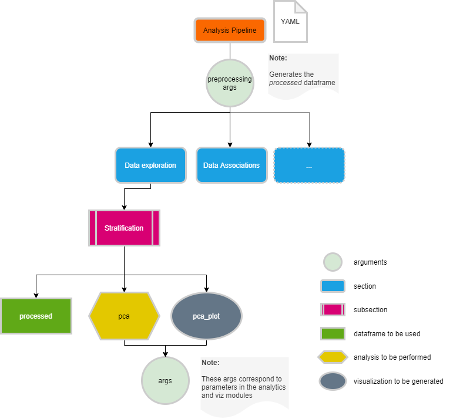

.. _analysis conf:

Define data analysis parameters
===============================

A multitude of different analysis methods and visualisation plots have been implemented within the ``analytics_core`` of the Clinical Knowledge Graph. The table below contains the current list of methods and visualizations available:

**Table CKG Analytics Core**

+------------------+---------------------------+----------------------------------------------+------------------------------------------------------------------------------------------------------------------------------------------------------------------------------------------------------------------------------------------------------------------------------------------------------------------------------------------------------------------------------------------------------+----------------------------------------+------------------------------------------------------------------------------------+----------------------------------------------------------------------------------------------------------------------------------------------------------------+
|                  |            Step           |                    Method                    |                                                                                                                                                                                              Description                                                                                                                                                                                             |              CKG function              |                                      Reference                                     | Link                                                                                                                                                           |
+------------------+---------------------------+----------------------------------------------+------------------------------------------------------------------------------------------------------------------------------------------------------------------------------------------------------------------------------------------------------------------------------------------------------------------------------------------------------------------------------------------------------+----------------------------------------+------------------------------------------------------------------------------------+----------------------------------------------------------------------------------------------------------------------------------------------------------------+
|                  |       Power analysis      | anova power   analysis                       | Determine the   sample size required to detect an effect of a given size with a given degree   of confidence                                                                                                                                                                                                                                                                                         | power_analysis                         | https://machinelearningmastery.com/statistical-power-and-power-analysis-in-python/ | https://www.statsmodels.org/stable/generated/statsmodels.stats.power.FTestAnovaPower.html                                                                      |
|                  +---------------------------+----------------------------------------------+------------------------------------------------------------------------------------------------------------------------------------------------------------------------------------------------------------------------------------------------------------------------------------------------------------------------------------------------------------------------------------------------------+----------------------------------------+------------------------------------------------------------------------------------+----------------------------------------------------------------------------------------------------------------------------------------------------------------+
|                  |                           | percentage                                   | Filtering   based on maximum percentage of missing values allowed (per group optional)                                                                                                                                                                                                                                                                                                               | extract_percentage_missing             |                                                                                    |                                                                                                                                                                |
|                  |         Filtering         +----------------------------------------------+------------------------------------------------------------------------------------------------------------------------------------------------------------------------------------------------------------------------------------------------------------------------------------------------------------------------------------------------------------------------------------------------------+----------------------------------------+------------------------------------------------------------------------------------+----------------------------------------------------------------------------------------------------------------------------------------------------------------+
|                  |                           | at_least_x                                   | Filtering   based on minimum number of present values (per group optional)                                                                                                                                                                                                                                                                                                                           | extract_number_missing                 |                                                                                    |                                                                                                                                                                |
|                  +---------------------------+----------------------------------------------+------------------------------------------------------------------------------------------------------------------------------------------------------------------------------------------------------------------------------------------------------------------------------------------------------------------------------------------------------------------------------------------------------+----------------------------------------+------------------------------------------------------------------------------------+----------------------------------------------------------------------------------------------------------------------------------------------------------------+
|                  |                           | K-nearest   Neighbors                        | Imputation   based on the algorithm Nearest Neighbors (NN)                                                                                                                                                                                                                                                                                                                                           | imputation_KNN                         | https://www.ncbi.nlm.nih.gov/pubmed/21743766                                       | https://pypi.org/project/fancyimpute/                                                                                                                          |
|                  |                           +----------------------------------------------+------------------------------------------------------------------------------------------------------------------------------------------------------------------------------------------------------------------------------------------------------------------------------------------------------------------------------------------------------------------------------------------------------+----------------------------------------+------------------------------------------------------------------------------------+----------------------------------------------------------------------------------------------------------------------------------------------------------------+
|                  |         Imputation        | Probabilistic Minimum Imputation approach    | Imputation   method replacing missing values with values withdrawn from a down-shifted   normal distribution                                                                                                                                                                                                                                                                                         | imputation_normal_distribution         | https://www.ncbi.nlm.nih.gov/pubmed/26906401                                       |                                                                                                                                                                |
|                  |                           +----------------------------------------------+------------------------------------------------------------------------------------------------------------------------------------------------------------------------------------------------------------------------------------------------------------------------------------------------------------------------------------------------------------------------------------------------------+----------------------------------------+------------------------------------------------------------------------------------+----------------------------------------------------------------------------------------------------------------------------------------------------------------+
| Data preparation |                           | Mixed model                                  | A   combination of KNN and Probabilistic Minimum depending on the number of   values available (>60% KNN, rest ProbMin)                                                                                                                                                                                                                                                                              | imputation_mixed_norm_KNN              |                                                                                    |                                                                                                                                                                |
|                  +---------------------------+----------------------------------------------+------------------------------------------------------------------------------------------------------------------------------------------------------------------------------------------------------------------------------------------------------------------------------------------------------------------------------------------------------------------------------------------------------+----------------------------------------+------------------------------------------------------------------------------------+----------------------------------------------------------------------------------------------------------------------------------------------------------------+
|                  |                           | Median                                       | Normalize   samples using the median                                                                                                                                                                                                                                                                                                                                                                 | median_normalization                   |                                                                                    |                                                                                                                                                                |
|                  |                           +----------------------------------------------+------------------------------------------------------------------------------------------------------------------------------------------------------------------------------------------------------------------------------------------------------------------------------------------------------------------------------------------------------------------------------------------------------+----------------------------------------+------------------------------------------------------------------------------------+----------------------------------------------------------------------------------------------------------------------------------------------------------------+
|                  |                           | Median polish                                | Normalization   based on the medians obtained from the rows and the columns to iteratively   calculate the row effect and column effect on the data                                                                                                                                                                                                                                                  | median_polish_normalization            |                                                                                    |                                                                                                                                                                |
|                  |       Normalization       +----------------------------------------------+------------------------------------------------------------------------------------------------------------------------------------------------------------------------------------------------------------------------------------------------------------------------------------------------------------------------------------------------------------------------------------------------------+----------------------------------------+------------------------------------------------------------------------------------+----------------------------------------------------------------------------------------------------------------------------------------------------------------+
|                  |                           | Quantile                                     | Adjustment   method that forces the observed distributions to be the same and it uses the   average of each quantile across samples as the reference (assumes the   statistical distribution of each sample is the same)                                                                                                                                                                             | quantile_normalization                 |                                                                                    |                                                                                                                                                                |
|                  |                           +----------------------------------------------+------------------------------------------------------------------------------------------------------------------------------------------------------------------------------------------------------------------------------------------------------------------------------------------------------------------------------------------------------------------------------------------------------+----------------------------------------+------------------------------------------------------------------------------------+----------------------------------------------------------------------------------------------------------------------------------------------------------------+
|                  |                           | Linear                                       | Apply   l1 or l2 normalization                                                                                                                                                                                                                                                                                                                                                                       | linear_normalization                   |                                                                                    | https://scikit-learn.org/stable/modules/preprocessing.html                                                                                                     |
|                  +---------------------------+----------------------------------------------+------------------------------------------------------------------------------------------------------------------------------------------------------------------------------------------------------------------------------------------------------------------------------------------------------------------------------------------------------------------------------------------------------+----------------------------------------+------------------------------------------------------------------------------------+----------------------------------------------------------------------------------------------------------------------------------------------------------------+
|                  | Batch   effect correction | COMBAT                                       | Adjust   for batch effects in datasets where the batch covariate is known                                                                                                                                                                                                                                                                                                                            | combat_batch_correction                | https://pubmed.ncbi.nlm.nih.gov/16632515/                                          | https://github.com/epigenelabs/pyComBat                                                                                                                        |
+------------------+---------------------------+----------------------------------------------+------------------------------------------------------------------------------------------------------------------------------------------------------------------------------------------------------------------------------------------------------------------------------------------------------------------------------------------------------------------------------------------------------+----------------------------------------+------------------------------------------------------------------------------------+----------------------------------------------------------------------------------------------------------------------------------------------------------------+
|                  |          Ranking          |                    Ranking                   | Ranking of   proteins based on intensity                                                                                                                                                                                                                                                                                                                                                             | get_ranking_with_markers               |                                                                                    |                                                                                                                                                                |
|                  +---------------------------+----------------------------------------------+------------------------------------------------------------------------------------------------------------------------------------------------------------------------------------------------------------------------------------------------------------------------------------------------------------------------------------------------------------------------------------------------------+----------------------------------------+------------------------------------------------------------------------------------+----------------------------------------------------------------------------------------------------------------------------------------------------------------+
|                  |  Coefficient of Variation |          Coefficient   of Variation          | Coefficient   of variation per group as a quality control                                                                                                                                                                                                                                                                                                                                            | get_coefficient_variation              |                                                                                    |                                                                                                                                                                |
| Data exploration +---------------------------+----------------------------------------------+------------------------------------------------------------------------------------------------------------------------------------------------------------------------------------------------------------------------------------------------------------------------------------------------------------------------------------------------------------------------------------------------------+----------------------------------------+------------------------------------------------------------------------------------+----------------------------------------------------------------------------------------------------------------------------------------------------------------+
|                  |         QC markers        |                  QC   Makers                 | If   there are quality control markers associated with the tissue studied, they   are used to visualize possible outliers (z-score) among the samples                                                                                                                                                                                                                                                | run_qc_markers_analysis                | https://www.ncbi.nlm.nih.gov/pubmed/31566909                                       |                                                                                                                                                                |
|                  +---------------------------+----------------------------------------------+------------------------------------------------------------------------------------------------------------------------------------------------------------------------------------------------------------------------------------------------------------------------------------------------------------------------------------------------------------------------------------------------------+----------------------------------------+------------------------------------------------------------------------------------+----------------------------------------------------------------------------------------------------------------------------------------------------------------+
|                  |    Summary   statistics   | Summary   statistics                         | Statistics for   rows and columns in the data matrix                                                                                                                                                                                                                                                                                                                                                 | get_summary_data_matrix                |                                                                                    |                                                                                                                                                                |
+------------------+---------------------------+----------------------------------------------+------------------------------------------------------------------------------------------------------------------------------------------------------------------------------------------------------------------------------------------------------------------------------------------------------------------------------------------------------------------------------------------------------+----------------------------------------+------------------------------------------------------------------------------------+----------------------------------------------------------------------------------------------------------------------------------------------------------------+
|                  |                           | PCA                                          | Principal   Component Analysis (2D, 3D)                                                                                                                                                                                                                                                                                                                                                              | run_pca                                | https://www.ncbi.nlm.nih.gov/pubmed/24061923                                       | https://scikit-learn.org/stable/modules/generated/sklearn.decomposition.PCA.html                                                                               |
|                  |                           +----------------------------------------------+------------------------------------------------------------------------------------------------------------------------------------------------------------------------------------------------------------------------------------------------------------------------------------------------------------------------------------------------------------------------------------------------------+----------------------------------------+------------------------------------------------------------------------------------+----------------------------------------------------------------------------------------------------------------------------------------------------------------+
|                  |  Dimensionality reduction | tSNE                                         | t-distributed   Stochastic Neighbor Embedding                                                                                                                                                                                                                                                                                                                                                        | run_tsne                               | https://www.ncbi.nlm.nih.gov/pubmed/30252473                                       | https://scikit-learn.org/stable/modules/generated/sklearn.manifold.TSNE.html                                                                                   |
|                  |                           +----------------------------------------------+------------------------------------------------------------------------------------------------------------------------------------------------------------------------------------------------------------------------------------------------------------------------------------------------------------------------------------------------------------------------------------------------------+----------------------------------------+------------------------------------------------------------------------------------+----------------------------------------------------------------------------------------------------------------------------------------------------------------+
|                  |                           | UMAP                                         | Uniform   Manifold Approximation and Projection                                                                                                                                                                                                                                                                                                                                                      | run_umap                               | https://arxiv.org/abs/1802.03426                                                   | https://umap-learn.readthedocs.io/                                                                                                                             |
|                  +---------------------------+----------------------------------------------+------------------------------------------------------------------------------------------------------------------------------------------------------------------------------------------------------------------------------------------------------------------------------------------------------------------------------------------------------------------------------------------------------+----------------------------------------+------------------------------------------------------------------------------------+----------------------------------------------------------------------------------------------------------------------------------------------------------------+
|                  |                           | SAMR                                         | Significance   analysis of microarrays applied to proteomics data                                                                                                                                                                                                                                                                                                                                    | run_samr                               | https://www.ncbi.nlm.nih.gov/pubmed/11309499                                       | https://www.rdocumentation.org/packages/samr/versions/3.0                                                                                                      |
|                  |                           +----------------------------------------------+------------------------------------------------------------------------------------------------------------------------------------------------------------------------------------------------------------------------------------------------------------------------------------------------------------------------------------------------------------------------------------------------------+----------------------------------------+------------------------------------------------------------------------------------+----------------------------------------------------------------------------------------------------------------------------------------------------------------+
|                  |                           | ANOVA                                        | Analysis   of Variance                                                                                                                                                                                                                                                                                                                                                                               | run_anova                              |                                                                                    | https://pingouin-stats.org/generated/pingouin.anova.html                                                                                                       |
|                  |     Hypothesis testing    +----------------------------------------------+------------------------------------------------------------------------------------------------------------------------------------------------------------------------------------------------------------------------------------------------------------------------------------------------------------------------------------------------------------------------------------------------------+----------------------------------------+------------------------------------------------------------------------------------+----------------------------------------------------------------------------------------------------------------------------------------------------------------+
|                  |                           | ANOVA-rm                                     | Analysis   of Variance for repeated measurements                                                                                                                                                                                                                                                                                                                                                     | run_repeated_measurements_anova        |                                                                                    | https://pingouin-stats.org/generated/pingouin.rm_anova.html                                                                                                    |
|                  |                           +----------------------------------------------+------------------------------------------------------------------------------------------------------------------------------------------------------------------------------------------------------------------------------------------------------------------------------------------------------------------------------------------------------------------------------------------------------+----------------------------------------+------------------------------------------------------------------------------------+----------------------------------------------------------------------------------------------------------------------------------------------------------------+
|                  |                           | t-test                                       | t-test   mean difference                                                                                                                                                                                                                                                                                                                                                                             | run_ttest                              |                                                                                    | https://pingouin-stats.org/generated/pingouin.ttest.html                                                                                                       |
|                  +---------------------------+----------------------------------------------+------------------------------------------------------------------------------------------------------------------------------------------------------------------------------------------------------------------------------------------------------------------------------------------------------------------------------------------------------------------------------------------------------+----------------------------------------+------------------------------------------------------------------------------------+----------------------------------------------------------------------------------------------------------------------------------------------------------------+
|                  |                           | Bonferroni                                   | Bonferroni   p-value correction                                                                                                                                                                                                                                                                                                                                                                      | apply_pvalue_correction                |                                                                                    | https://www.statsmodels.org/stable/generated/statsmodels.stats.multitest.multipletests.html                                                                    |
|                  |                           +----------------------------------------------+------------------------------------------------------------------------------------------------------------------------------------------------------------------------------------------------------------------------------------------------------------------------------------------------------------------------------------------------------------------------------------------------------+----------------------------------------+------------------------------------------------------------------------------------+----------------------------------------------------------------------------------------------------------------------------------------------------------------+
|                  |                           | Benjamini-Hochberg                           | Benjamini-Hochberg   FDR correction                                                                                                                                                                                                                                                                                                                                                                  | apply_pvalue_correction                |                                                                                    | https://www.statsmodels.org/stable/generated/statsmodels.stats.multitest.multipletests.html                                                                    |
|                  |  Multiple-test correction +----------------------------------------------+------------------------------------------------------------------------------------------------------------------------------------------------------------------------------------------------------------------------------------------------------------------------------------------------------------------------------------------------------------------------------------------------------+----------------------------------------+------------------------------------------------------------------------------------+----------------------------------------------------------------------------------------------------------------------------------------------------------------+
|                  |                           | Permutation-FDR                              | Permutation   FDR                                                                                                                                                                                                                                                                                                                                                                                    | apply_pvalue_permutation_fdrcorrection | https://www.jstor.org/stable/2346101                                               |                                                                                                                                                                |
|                  |                           +----------------------------------------------+------------------------------------------------------------------------------------------------------------------------------------------------------------------------------------------------------------------------------------------------------------------------------------------------------------------------------------------------------------------------------------------------------+----------------------------------------+------------------------------------------------------------------------------------+----------------------------------------------------------------------------------------------------------------------------------------------------------------+
|                  |                           | …                                            | …                                                                                                                                                                                                                                                                                                                                                                                                    | apply_pvalue_correction                |                                                                                    | https://www.statsmodels.org/stable/generated/statsmodels.stats.multitest.multipletests.html                                                                    |
|   Data analysis  +---------------------------+----------------------------------------------+------------------------------------------------------------------------------------------------------------------------------------------------------------------------------------------------------------------------------------------------------------------------------------------------------------------------------------------------------------------------------------------------------+----------------------------------------+------------------------------------------------------------------------------------+----------------------------------------------------------------------------------------------------------------------------------------------------------------+
|                  |                           | Correlation                                  | Pearson or   Spearman correlation                                                                                                                                                                                                                                                                                                                                                                    | run_correlation                        |                                                                                    |                                                                                                                                                                |
|                  |        Correlation        +----------------------------------------------+------------------------------------------------------------------------------------------------------------------------------------------------------------------------------------------------------------------------------------------------------------------------------------------------------------------------------------------------------------------------------------------------------+----------------------------------------+------------------------------------------------------------------------------------+----------------------------------------------------------------------------------------------------------------------------------------------------------------+
|                  |                           | Correlation-rm                               | Pearson   or Spearman correlation for repeated measurements                                                                                                                                                                                                                                                                                                                                          | run_rm_correlation                     |                                                                                    | https://pingouin-stats.org/generated/pingouin.rm_corr.html                                                                                                     |
|                  +---------------------------+----------------------------------------------+------------------------------------------------------------------------------------------------------------------------------------------------------------------------------------------------------------------------------------------------------------------------------------------------------------------------------------------------------------------------------------------------------+----------------------------------------+------------------------------------------------------------------------------------+----------------------------------------------------------------------------------------------------------------------------------------------------------------+
|                  |                           | Single   Sample Gene Set Enrichment Analysis | Single-sample   GSEA (ssGSEA), an extension of Gene Set Enrichment Analysis (GSEA),   calculates separate enrichment scores for each pairing of a sample and gene   set.  Each ssGSEA enrichment score   represents the degree to which the genes in a particular gene set are   coordinately up- or down-regulated within a sample.   (https://www.genepattern.org/modules/docs/ssGSEAProjection/4) | run_ssgsea                             | https://pubmed.ncbi.nlm.nih.gov/16199517/                                          | https://github.com/zqfang/gseapy                                                                                                                               |
|                  |         Enrichment        +----------------------------------------------+------------------------------------------------------------------------------------------------------------------------------------------------------------------------------------------------------------------------------------------------------------------------------------------------------------------------------------------------------------------------------------------------------+----------------------------------------+------------------------------------------------------------------------------------+----------------------------------------------------------------------------------------------------------------------------------------------------------------+
|                  |                           | Fisher Exact Test                            | Significant   test for contingency tables                                                                                                                                                                                                                                                                                                                                                            | run_enrichment                         |                                                                                    | https://docs.scipy.org/doc/scipy/reference/generated/scipy.stats.fisher_exact.html                                                                             |
|                  +---------------------------+----------------------------------------------+------------------------------------------------------------------------------------------------------------------------------------------------------------------------------------------------------------------------------------------------------------------------------------------------------------------------------------------------------------------------------------------------------+----------------------------------------+------------------------------------------------------------------------------------+----------------------------------------------------------------------------------------------------------------------------------------------------------------+
|                  |                           | Louvain   partition                          | Best   partition algorithm                                                                                                                                                                                                                                                                                                                                                                           | get_louvain_partitions                 | https://www.ncbi.nlm.nih.gov/pubmed/21517554                                       | https://python-louvain.readthedocs.io/en/latest/api.html                                                                                                       |
|                  |                           +----------------------------------------------+------------------------------------------------------------------------------------------------------------------------------------------------------------------------------------------------------------------------------------------------------------------------------------------------------------------------------------------------------------------------------------------------------+----------------------------------------+------------------------------------------------------------------------------------+----------------------------------------------------------------------------------------------------------------------------------------------------------------+
|                  |                           | Greedy modularity                            | A   hierarchical agglomeration algorithm for detecting community structure                                                                                                                                                                                                                                                                                                                           | get_network_communities                | https://www.ncbi.nlm.nih.gov/pubmed/15697438                                       | https://networkx.github.io/documentation/stable/reference/algorithms/generated/networkx.algorithms.community.modularity_max.greedy_modularity_communities.html |
|                  |                           +----------------------------------------------+------------------------------------------------------------------------------------------------------------------------------------------------------------------------------------------------------------------------------------------------------------------------------------------------------------------------------------------------------------------------------------------------------+----------------------------------------+------------------------------------------------------------------------------------+----------------------------------------------------------------------------------------------------------------------------------------------------------------+
|                  |                           | Asynchronous label propagation algorithm     | The   algorithm initializes each node with a unique label and repeatedly sets the   label of a node to be the label that appears most frequently among that nodes   neighbors. The algorithm halts when each node has the label that appears most   frequently among its neighbors                                                                                                                   | get_network_communities                | https://www.ncbi.nlm.nih.gov/pubmed/17930305                                       | https://networkx.github.io/documentation/stable/reference/algorithms/generated/networkx.algorithms.community.label_propagation.asyn_lpa_communities.html#id3   |
|                  |      Network analysis     +----------------------------------------------+------------------------------------------------------------------------------------------------------------------------------------------------------------------------------------------------------------------------------------------------------------------------------------------------------------------------------------------------------------------------------------------------------+----------------------------------------+------------------------------------------------------------------------------------+----------------------------------------------------------------------------------------------------------------------------------------------------------------+
|                  |                           | Girvan-Newman algorithm                      | Hierachical   algorithm that removes edges iteratively and defining communities by the   remaining connected components                                                                                                                                                                                                                                                                              | get_network_communities                |                                                                                    | https://networkx.github.io/documentation/stable/reference/algorithms/generated/networkx.algorithms.community.centrality.girvan_newman.html                     |
|                  |                           +----------------------------------------------+------------------------------------------------------------------------------------------------------------------------------------------------------------------------------------------------------------------------------------------------------------------------------------------------------------------------------------------------------------------------------------------------------+----------------------------------------+------------------------------------------------------------------------------------+----------------------------------------------------------------------------------------------------------------------------------------------------------------+
|                  |                           | Affinity propagation                         | A   centroid-based clustering algorithm that finds members of the input set that   are representative of clusters and estimates the number of clusters                                                                                                                                                                                                                                               | get_network_communities                | https://www.ncbi.nlm.nih.gov/pubmed/17218491                                       | https://scikit-learn.org/stable/modules/generated/sklearn.cluster.affinity_propagation.html                                                                    |
|                  |                           +----------------------------------------------+------------------------------------------------------------------------------------------------------------------------------------------------------------------------------------------------------------------------------------------------------------------------------------------------------------------------------------------------------------------------------------------------------+----------------------------------------+------------------------------------------------------------------------------------+----------------------------------------------------------------------------------------------------------------------------------------------------------------+
|                  |                           | Similarity Network Fusion                    | SNF computes   and fuses patient similarity networks obtained from each of their data types   separately, taking advantage of the complementarity in the data.                                                                                                                                                                                                                                       | run_snf                                | https://pubmed.ncbi.nlm.nih.gov/24464287/                                          | https://snfpy.readthedocs.io/en/latest/                                                                                                                        |
|                  +---------------------------+----------------------------------------------+------------------------------------------------------------------------------------------------------------------------------------------------------------------------------------------------------------------------------------------------------------------------------------------------------------------------------------------------------------------------------------------------------+----------------------------------------+------------------------------------------------------------------------------------+----------------------------------------------------------------------------------------------------------------------------------------------------------------+
|                  |         Multiomics        | WGCNA                                        | Weighted gene   co-expression network analysis for describing the correlation patterns among   proteinsfinding clusters (modules) of highly correlated genes, for   summarizing such clusters using the module eigengene or an intramodular hub   gene, for relating modules to one another and to external sample traits                                                                            | run_WGCNA                              | https://www.ncbi.nlm.nih.gov/pubmed/19114008                                       | https://horvath.genetics.ucla.edu/html/CoexpressionNetwork/Rpackages/WGCNA/                                                                                    |
+------------------+---------------------------+----------------------------------------------+------------------------------------------------------------------------------------------------------------------------------------------------------------------------------------------------------------------------------------------------------------------------------------------------------------------------------------------------------------------------------------------------------+----------------------------------------+------------------------------------------------------------------------------------+----------------------------------------------------------------------------------------------------------------------------------------------------------------+
|                  |                           | Pie   chart                                  | Circular   statistical chart, which is divided into sectors to illustrate numerical   proportion                                                                                                                                                                                                                                                                                                     | get_pieplot                            |                                                                                    | https://plotly.com/python/pie-charts/                                                                                                                          |
|                  |                           +----------------------------------------------+------------------------------------------------------------------------------------------------------------------------------------------------------------------------------------------------------------------------------------------------------------------------------------------------------------------------------------------------------------------------------------------------------+----------------------------------------+------------------------------------------------------------------------------------+----------------------------------------------------------------------------------------------------------------------------------------------------------------+
|                  |                           | Distribution plot                            | Representations   of statistical distributions                                                                                                                                                                                                                                                                                                                                                       | get_distplot                           |                                                                                    | https://plotly.com/python/distplot/                                                                                                                            |
|                  |                           +----------------------------------------------+------------------------------------------------------------------------------------------------------------------------------------------------------------------------------------------------------------------------------------------------------------------------------------------------------------------------------------------------------------------------------------------------------+----------------------------------------+------------------------------------------------------------------------------------+----------------------------------------------------------------------------------------------------------------------------------------------------------------+
|                  |                           | Bar chart                                    |                                                                                                                                                                                                                                                                                                                                                                                                      | get_barplot                            |                                                                                    | https://plotly.com/python/bar-charts/                                                                                                                          |
|                  |                           +----------------------------------------------+------------------------------------------------------------------------------------------------------------------------------------------------------------------------------------------------------------------------------------------------------------------------------------------------------------------------------------------------------------------------------------------------------+----------------------------------------+------------------------------------------------------------------------------------+----------------------------------------------------------------------------------------------------------------------------------------------------------------+
|                  |                           | Scatter plot matrix                          |                                                                                                                                                                                                                                                                                                                                                                                                      | get_facet_grid_plot                    |                                                                                    |                                                                                                                                                                |
|                  |                           +----------------------------------------------+------------------------------------------------------------------------------------------------------------------------------------------------------------------------------------------------------------------------------------------------------------------------------------------------------------------------------------------------------------------------------------------------------+----------------------------------------+------------------------------------------------------------------------------------+----------------------------------------------------------------------------------------------------------------------------------------------------------------+
|                  |                           | Ranking plot                                 |                                                                                                                                                                                                                                                                                                                                                                                                      | get_ranking_plot                       |                                                                                    |                                                                                                                                                                |
|                  |                           +----------------------------------------------+------------------------------------------------------------------------------------------------------------------------------------------------------------------------------------------------------------------------------------------------------------------------------------------------------------------------------------------------------------------------------------------------------+----------------------------------------+------------------------------------------------------------------------------------+----------------------------------------------------------------------------------------------------------------------------------------------------------------+
|                  |                           | Scatter plot                                 |                                                                                                                                                                                                                                                                                                                                                                                                      | get_simple_scatterplot                 |                                                                                    |                                                                                                                                                                |
|                  |                           +----------------------------------------------+------------------------------------------------------------------------------------------------------------------------------------------------------------------------------------------------------------------------------------------------------------------------------------------------------------------------------------------------------------------------------------------------------+----------------------------------------+------------------------------------------------------------------------------------+----------------------------------------------------------------------------------------------------------------------------------------------------------------+
|                  |                           | Volcano plot                                 |                                                                                                                                                                                                                                                                                                                                                                                                      | run_volcano                            |                                                                                    |                                                                                                                                                                |
|                  |                           +----------------------------------------------+------------------------------------------------------------------------------------------------------------------------------------------------------------------------------------------------------------------------------------------------------------------------------------------------------------------------------------------------------------------------------------------------------+----------------------------------------+------------------------------------------------------------------------------------+----------------------------------------------------------------------------------------------------------------------------------------------------------------+
|                  |                           | Heatmap plot                                 |                                                                                                                                                                                                                                                                                                                                                                                                      | get_heatmapplot                        |                                                                                    |                                                                                                                                                                |
|                  |                           +----------------------------------------------+------------------------------------------------------------------------------------------------------------------------------------------------------------------------------------------------------------------------------------------------------------------------------------------------------------------------------------------------------------------------------------------------------+----------------------------------------+------------------------------------------------------------------------------------+----------------------------------------------------------------------------------------------------------------------------------------------------------------+
|                  |                           | Heatmap plot with annotation and clustering  |                                                                                                                                                                                                                                                                                                                                                                                                      | get_complex_heatmapplot                |                                                                                    |                                                                                                                                                                |
|                  |                           +----------------------------------------------+------------------------------------------------------------------------------------------------------------------------------------------------------------------------------------------------------------------------------------------------------------------------------------------------------------------------------------------------------------------------------------------------------+----------------------------------------+------------------------------------------------------------------------------------+----------------------------------------------------------------------------------------------------------------------------------------------------------------+
|                  |                           | Network                                      | Generates   a Cytoscape network (Plot.ly), a Jupyter notebook compatible Cytoscape   network (Cyjupyter) and a json format network                                                                                                                                                                                                                                                                   | get_network                            | https://www.ncbi.nlm.nih.gov/pubmed/14597658                                       | https://dash.plotly.com/cytoscape                                                                                                                              |
|                  |                           +----------------------------------------------+------------------------------------------------------------------------------------------------------------------------------------------------------------------------------------------------------------------------------------------------------------------------------------------------------------------------------------------------------------------------------------------------------+----------------------------------------+------------------------------------------------------------------------------------+----------------------------------------------------------------------------------------------------------------------------------------------------------------+
|   Visualization  |            Viz            | PCA plot                                     | PCA   plot with loadings (2D and 3D)                                                                                                                                                                                                                                                                                                                                                                 | get_pca_plot                           |                                                                                    |                                                                                                                                                                |
|                  |                           +----------------------------------------------+------------------------------------------------------------------------------------------------------------------------------------------------------------------------------------------------------------------------------------------------------------------------------------------------------------------------------------------------------------------------------------------------------+----------------------------------------+------------------------------------------------------------------------------------+----------------------------------------------------------------------------------------------------------------------------------------------------------------+
|                  |                           | Sankey diagram                               | Visualize   the contributions to a flow                                                                                                                                                                                                                                                                                                                                                              | get_sankey_plot                        |                                                                                    |                                                                                                                                                                |
|                  |                           +----------------------------------------------+------------------------------------------------------------------------------------------------------------------------------------------------------------------------------------------------------------------------------------------------------------------------------------------------------------------------------------------------------------------------------------------------------+----------------------------------------+------------------------------------------------------------------------------------+----------------------------------------------------------------------------------------------------------------------------------------------------------------+
|                  |                           | Table                                        |                                                                                                                                                                                                                                                                                                                                                                                                      | get_table                              |                                                                                    | https://dash.plotly.com/datatable                                                                                                                              |
|                  |                           +----------------------------------------------+------------------------------------------------------------------------------------------------------------------------------------------------------------------------------------------------------------------------------------------------------------------------------------------------------------------------------------------------------------------------------------------------------+----------------------------------------+------------------------------------------------------------------------------------+----------------------------------------------------------------------------------------------------------------------------------------------------------------+
|                  |                           | Violin plot                                  |                                                                                                                                                                                                                                                                                                                                                                                                      | get_violinplot                         |                                                                                    | https://plotly.com/python/violin/                                                                                                                              |
|                  |                           +----------------------------------------------+------------------------------------------------------------------------------------------------------------------------------------------------------------------------------------------------------------------------------------------------------------------------------------------------------------------------------------------------------------------------------------------------------+----------------------------------------+------------------------------------------------------------------------------------+----------------------------------------------------------------------------------------------------------------------------------------------------------------+
|                  |                           | Parallel coordinates plot                    |                                                                                                                                                                                                                                                                                                                                                                                                      | get_parallel_plot                      |                                                                                    | https://plotly.com/python/parallel-coordinates-plot/                                                                                                           |
|                  |                           +----------------------------------------------+------------------------------------------------------------------------------------------------------------------------------------------------------------------------------------------------------------------------------------------------------------------------------------------------------------------------------------------------------------------------------------------------------+----------------------------------------+------------------------------------------------------------------------------------+----------------------------------------------------------------------------------------------------------------------------------------------------------------+
|                  |                           | WGCNA plots                                  | Generates   all the plots for the WGCNA analysis                                                                                                                                                                                                                                                                                                                                                     | get_WGCNAPlots                         | https://www.ncbi.nlm.nih.gov/pubmed/19114008                                       | https://horvath.genetics.ucla.edu/html/CoexpressionNetwork/Rpackages/WGCNA/                                                                                    |
|                  |                           +----------------------------------------------+------------------------------------------------------------------------------------------------------------------------------------------------------------------------------------------------------------------------------------------------------------------------------------------------------------------------------------------------------------------------------------------------------+----------------------------------------+------------------------------------------------------------------------------------+----------------------------------------------------------------------------------------------------------------------------------------------------------------+
|                  |                           | 2-way Venn diagram                           |                                                                                                                                                                                                                                                                                                                                                                                                      | get_2_venn_diagram                     |                                                                                    | https://plotly.com/python/shapes/                                                                                                                              |
|                  |                           +----------------------------------------------+------------------------------------------------------------------------------------------------------------------------------------------------------------------------------------------------------------------------------------------------------------------------------------------------------------------------------------------------------------------------------------------------------+----------------------------------------+------------------------------------------------------------------------------------+----------------------------------------------------------------------------------------------------------------------------------------------------------------+
|                  |                           | Word cloud                                   | Represents   the frequency of words in a text using size and color                                                                                                                                                                                                                                                                                                                                   | get_wordcloud                          |                                                                                    | https://github.com/PrashantSaikia/Wordcloud-in-Plotly                                                                                                          |
|                  |                           +----------------------------------------------+------------------------------------------------------------------------------------------------------------------------------------------------------------------------------------------------------------------------------------------------------------------------------------------------------------------------------------------------------------------------------------------------------+----------------------------------------+------------------------------------------------------------------------------------+----------------------------------------------------------------------------------------------------------------------------------------------------------------+
|                  |                           | Save Dash plot                               | Save   a Dash figure object to svg format                                                                                                                                                                                                                                                                                                                                                            | save_DASH_plot                         |                                                                                    |                                                                                                                                                                |
|                  |                           +----------------------------------------------+------------------------------------------------------------------------------------------------------------------------------------------------------------------------------------------------------------------------------------------------------------------------------------------------------------------------------------------------------------------------------------------------------+----------------------------------------+------------------------------------------------------------------------------------+----------------------------------------------------------------------------------------------------------------------------------------------------------------+
|                  |                           | Kaplan-meier plot                            | Kaplan-meier   survival plot with significance annotation                                                                                                                                                                                                                                                                                                                                            | get_km_plot                            |                                                                                    | https://plotly.com/python/v3/ipython-notebooks/survival-analysis-r-vs-python/                                                                                  |
|                  |                           +----------------------------------------------+------------------------------------------------------------------------------------------------------------------------------------------------------------------------------------------------------------------------------------------------------------------------------------------------------------------------------------------------------------------------------------------------------+----------------------------------------+------------------------------------------------------------------------------------+----------------------------------------------------------------------------------------------------------------------------------------------------------------+
|                  |                           | Polar chart                                  | Represents   data along radial and angular axes                                                                                                                                                                                                                                                                                                                                                      | get_polar_plot                         |                                                                                    | https://plotly.com/python/polar-chart/                                                                                                                         |
+------------------+---------------------------+----------------------------------------------+------------------------------------------------------------------------------------------------------------------------------------------------------------------------------------------------------------------------------------------------------------------------------------------------------------------------------------------------------------------------------------------------------+----------------------------------------+------------------------------------------------------------------------------------+----------------------------------------------------------------------------------------------------------------------------------------------------------------+

The default workflow makes use of the functions defined in this module and runs, for each data type, the analysis pipeline defined in a configuration file. These configuration files are defined in YAML format (https://yaml.org/spec/1.2/spec.html), which can 
be easily read in Python into a dictionary structure with sections and analyses. For each analysis we need to define the data that will be used (i.e original data), how the results will be visualized (i.e pca_plot) and what parameters need to be used (i.e components: 2).

In the CKG, we have default analyses defined for clinical, proteomics, phosphoproteomics and interactomics datasets. All the analysis configuration files can be modified to fit your project or data. 
To check how each configuration files look like and how to modify them, please follow the links below and also review the specific functions in CKG's :ref:`API` to define the args to use.

.. toctree::
   :caption: Data configuration files

   data_settings/clinical-data
   data_settings/proteomics
   data_settings/multiomics

Adding New Analyses or visualizations
^^^^^^^^^^^^^^^^^^^^^^^^^^^^^^^^^^^^^^
If you would like to contribute to CKG and add new analysis or visualization functions you can implement them in the :ref:`analytics` or :ref:`visualization` modules respectively.
To make your new analysis or visualization available as part of the default analytical pipeline, you will need to add a conditional block in the :ref:`analytics_factory` module. For instance:

.. code-block:: python

   elif self.analysis_type == "NEW_ANALYSIS":
      arg1 = 'VALUE'
      arg2 = 'VALUE'
      arg3 = 'VALUE'
      if "arg1" in self.args:
         arg1 = self.args["arg1"]
      if "arg2" in self.args:
         arg2 = self.args["arg2"]
      if "arg3" in self.args:
         arg3 = self.args["arg3"]
      self.result[self.analysis_type] = analytics.run_new_function(self.data, arg1=arg1, arg2=arg2, arg3=arg3)

To incorporate this new analysis into the configuration file just add a new section, for example:

.. code-block:: yaml

   new analysis section:
      new analysis subsection:
         description: 'This is a new function in the analytics core'
         data: processed
         analyses:
            - NEW_ANALYSIS
         plots:
            - scatterplot
         args:
            arg1: 'value1'
            arg2: 'value2'
            arg3: 'value3'
            x_title: 'x axis'
            y_title: 'y axis'
            width: 1000
            height: 700
            title: 'Scatter plot for my new analysis'

Finally, just add the new function to the table here in the docs :)!