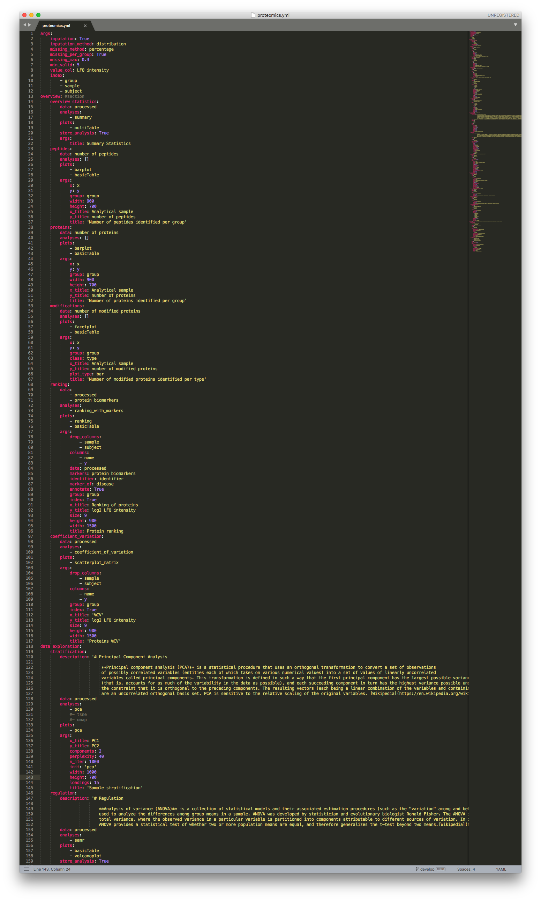

.. _Proteomics Data conf file:

Proteomics data analysis parameters
====================================

Similarly to the :ref:`Clinical Data conf file`, the Proteomics configuration file is divided into sections: ``args``, ``overview``, ``data exploration``, ``data associations`` and ``enrichment``.

    Proteomics configuration file

The proteomics default analysis pipeline can be accessed `here <https://raw.githubusercontent.com/MannLabs/CKG/master/ckg/report_manager/config/proteomics.yml>`__.

The ``args`` section contains the parameters used to process the proteomics data extracted from the CKG database, which includes the filtering of proteins according to the determined threshold, as well as the imputation of all missing values. These parameters include:

	- **imputation**: boolean. Set to *True* if missing values shall be imputed.
	- **imputation_method**: method for missing values imputation ("KNN", "distribuition", or "mixed").
	- **missing_method**:
	- **missing_per_group**: boolean. If *True*, proteins are filtered based on valid values per group; if *False* filter across all samples.
	- **missing_max**: maximum ratio of missing/valid values to be filtered. (e.g. **0.3** filters all proteins with more than 30% missing values).
	- **min_valid**: minimum number of required valid values to keep a protein.
	- **value_col**: column label containing expression values.
	- **index**: column labels to be be kept as index identifiers.

The result is a Pandas dataframe, stored as "processed", where columns are protein identifiers (UniprotID~GeneName) and analytical samples are rows, group and subject identifier are kept as columns as well.

.. note:: We advise to change only **imputation**, **imputation_method**, **missing_method**, **missing_per_group**, and **missing_max** or **min_valid**.

.. figure:: ../../_static/images/proteomics_config_2.png
    :width: 350px
    :align: right

    Proteomics configuration file (*continuation*)

The second section (``overview``) corresponds to basic statistics and includes:
	
	- Data summary statistics (**overview statistics**)
	- Number of peptides per sample (**peptides**)
	- Number of proteins per sample (**proteins**)
	- Number of modifications per sample (**modifications**)
	- Dynamic range per group (**ranking**)
	- Coefficient of variation per group (**coefficient_variation**)
	
In the ``data exploration`` section, we look at the sample stratification (**stratification**), differentially expressed proteins (**regulation**), and protein-protein correlation network (**correlation**). In this section, you can choose to modify parameters like ``alpha`` (FDR value), ``s0`` (artificial within groups variance) or ``fc`` (fold-change), to better fit your data and experimental design. Likewise, the correlation network is, by default, set to show correlations above 50% (``cutoff: 0.5``), this too can be changed.

The ``data associations`` section includes analyses that correlated differentially expressed proteins to proteins (**interaction_network**), drugs (**drug_associations**), diseases (**disease_associations**) and publications (**literature_associations**). All these associations are directly queried from the CKG database.

The last section in the default analysis pipeline corresponds to the ``enrichment`` analysis, and includes both Gene Ontology (**go_enrichment**) and Pathway (**pathway_enrichment**) enrichment analyses, using Fisher's exact test (``method: fisher``)

Likewise in the :ref:`Clinical Data conf file`, within each analysis, specific parameters are defined:
	
	- **description**: Definition of the analysis used.
	- **data**: defines on which dataset dataframe the analysis will be ran (e.g. "clinical variables", "original", "processed").
	- **analyses**: which statistical analysis to run on the ``data``. These functions are called from the mocdule ``analytics_factory.py``.
	- **plots**: which plot to use to show the results of **analyses**. Functions also called from the mocdule ``analytics_factory.py``.
	- **store_analysis**: boolean. True if the dataframe resulting from **analyses** is to be stored.
	- **args**: all arguments necessary for **analyses** and **plots**.

You can modify the analysis parameters just by changing the respective parameters within the configuration file. Remember to consult the modules ``analytics.py`` and ``viz.py``, to learn more about the arguments of each function.
If you would like to add a specific analysis step to the default pipeline, remember to add a call to the function in ``analytics_factory.py``.
