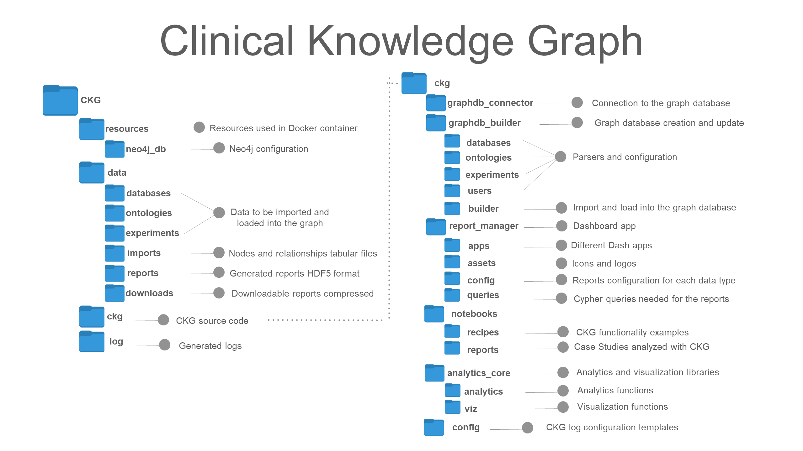

#######################################
Clinical Knowledge Graph
#######################################

This web page contains the documentation for the Clinical Knowledge Graph using **Sphinx**.

.. toctree::
   :maxdepth: 2

   INTRO

Requirements
---------------------
:doc:`System Requirements <system_requirements>`

.. toctree::
  :maxdepth: 2
  :hidden:
  :caption: Requirements

  system_requirements

Installation
-----------------

Follow this guide to get the Clinical Knowledge Graph installed. There are two options:

1) Install each of the requirements

2) Build the Docker image and run everything (Neo4j, CKG app and Jupyter Hub) into one single container *(Recommended)*

* :doc:`Installation <intro/getting-started-with-requirements>`

* :doc:`Create new user <intro/create-new-user>`

.. toctree::
   :maxdepth: 2
   :hidden:
   :caption: Installation

   intro/getting-started-with-requirements
   intro/getting-started-with-docker
   intro/getting-started-with-neo4j
   intro/getting-started-with-build
   intro/create-new-user

Getting started
-------------------------------------------------

Are you new to the Clinical Knowledge Graph? Learn about how to use it and
all the possibilities.

* **Creating a project and getting a report out (default configuration)**
  :doc:`Getting Started with CKG <getting_started/getting_started_steps>`

* **Connecting to CKG Graph Database**:
  :doc:`Connect to DB <getting_started/connect-to-ckg>`

* **Define a different Analysis Pipeline**:
  :doc:`Configuration <getting_started/data-analysis-config>`

* **Report Notification**:
  :doc:`Notifications <getting_started/notifications>`

.. toctree::
  :maxdepth: 2
  :hidden:
  :caption: Getting started

  getting_started/getting_started_steps
  getting_started/connect-to-ckg
  getting_started/data-analysis-config
  getting_started/notifications

CKG Graph Database Builder
-------------------------------------

* **Building CKG's Graph Database**:
  :doc:`Builder <ckg_builder/graphdb-builder>`

* **Adding New Resources**:
  :doc:`Contributing <ckg_builder/graphdb-contribute>`

.. toctree::
   :maxdepth: 2
   :hidden:
   :caption: CKG Graph Database Builder

   ckg_builder/graphdb-builder
   ckg_builder/graphdb-contribute

Project Report
------------------

* **Generate a project**:
  :doc:`Project <project_report/project-report>`

.. toctree::
  :maxdepth: 2
  :hidden:
  :caption: Project Report

  project_report/project-report

Notebooks
--------------

* **Jupyter Notebooks**:
  :doc:`Notebooks <advanced_features/ckg-notebooks>`

.. toctree::
  :maxdepth: 2
  :hidden:
  :caption: Jupyter Notebooks

  advanced_features/ckg-notebooks

More features
------------------

* **CKG Import Statistics**:
  :doc:`Imports stats <advanced_features/import-statistics>`

* **Retrieving data from the CKG**:
  :doc:`DB Querying <advanced_features/ckg-queries>`

.. toctree::
   :maxdepth: 2
   :hidden:
   :caption: More

   advanced_features/import-statistics
   advanced_features/ckg-queries

API Reference
-------------

Code available in `GitHub <https://github.com/MannLabs/CKG>`__.

.. toctree::
   :maxdepth: 4
   :caption: API docs

   api/ckg

About CKG
-------------

.. toctree::
   :maxdepth: 2
   :caption: About

   MANIFEST

Index
-----

* :ref:`genindex`
* :ref:`modindex`
* :ref:`search`
