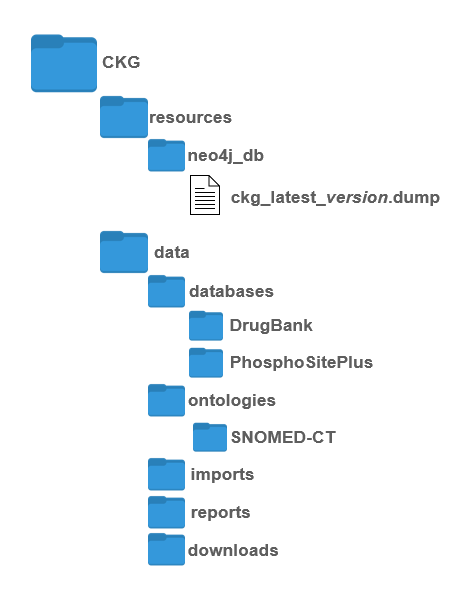
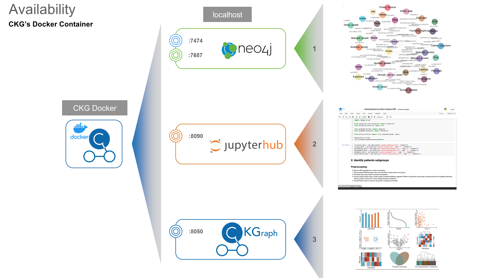

.. _CKG Docker Container:

CKG Docker Container
============================================

In this section we describe how to set up the Clinical Knowledge Graph from a Docker container. 

**What is Docker?**
	Docker is an open platform for developing, shipping, and running applications. Docker enables you to separate your applications from your infrastructure so you can deliver software quickly.
	With Docker, you can manage your infrastructure in the same ways you manage your applications. 
	By taking advantage of Docker’s methodologies for shipping, testing, and deploying code quickly, you can significantly reduce the delay between writing code and running it in production (*source: https://docs.docker.com/get-started/overview/ *). 

This container will install all the requirements needed, download source databases and build the CKG graph database, and open 5 ports through which to interact with the CKG.

.. warning:: This requires Docker to be previously installed (https://docs.docker.com/engine/install/). Notice that the installation in Unix systems is a bit different than in Windows or MacOS, check the instructions for your specific distribution (https://docs.docker.com/engine/install/#server).

.. warning:: Building the container requires **~280Gb of disk space**. The image takes ~120Gb but during the building process you will need around 280Gb of disk space available (loading the database dump takes quite a bit of disk temporarily).

To run the Docker, simply:

1. Clone CKG’s repository: https://github.com/MannLabs/CKG

2. Get licensed databases: :ref:`licenced databases`

3. Download the database dump from `here <https://datashare.biochem.mpg.de/s/kCW7uKZYTfN8mwg/download>`__ and place it into CKG/resources/neo4j_db
	    
4. Download the data folder from `here <https://datashare.biochem.mpg.de/s/fP6MKhLRfceWwxC/download>`__ and extract the compressed data into CKG/ folder and c
   
5. Copy the licensed databases in the right directories: 

- CKG/data/databases/{DrugBank|PhosphoSitePlus}

- CKG/data/ontologies/SNOMED-CT

The data folder will look like this afterwards:

1. Build  thecontainer: 

.. code-block:: bash
	
	$ cd CKG/
	$ docker build -t docker-ckg:latest .

7. Run docker:

.. code-block:: bash

	$ docker run -d --name ckgapp -p 7474:7474 -p 7687:7687 -p 8090:8090 -p 8050:8050 docker-ckg:latest

Once the container is running, you can open an interactive bash session using:

.. code-block:: bash

	$ docker exec -it ckgapp bash

You will have access to the logs within the container at:

- **Neo4j**: ``/var/log/neo4j``

- **CKG**: ``/CKG/log``

- **uwsgi**: ``/var/log/uwsgi``

Once the docker is running:

1. Access JupyterHub: http://localhost:8090/:

- user:ckguser

- password:ckguser

2. Access Neo4j browser (connection may take several minutes): http://localhost:7474/

3. Login using: 

- user: neo4j

- password: NeO4J

When the database is running:

1. In your web browser access CKG app: http://localhost:8050/
2. Login using the test user:

- user: test_user

- password: test_user
  
3. In the Home page navigate to the Admin page

4. Run Minimal update (:ref:`minimal update`)(these can take a while but will run in the background. Follow progress in the docker dashboard logs) and create a user

5. Explore options in CKG

.. note:: Remember that with Docker Desktop (https://www.docker.com/products/docker-desktop), you can check the logs of the running image.

