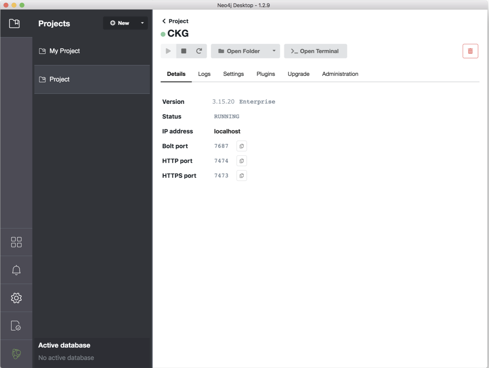

.. _Installing Neo4j:

.. include:: ../global.rst

Installing Neo4j
===================

Getting started with Neo4j is easy, just install Neo4j desktop and you are ready.

Neo4j Desktop (Windows/MacOS)
^^^^^^^^^^^^^^^^^^^^^^^^^^^^^^

You can download Neo4j Desktop from the `Neo4j download page <https://neo4j.com/download/>`__. Neo4j Desktop is bundled with a Java so you won't need to install Java separately. If you decide to install Neo4j directly, please check the requirements `here <https://neo4j.com/docs/operations-manual/current/installation/requirements/>`__.
The Community Edition of the software is free but a sign up is required.
Once the file has downloaded, you can install Neo4j by following the instructions automatically opened in the browser.

.. image:: ../_static/images/neo4j_app1.png
    :width: 32%
.. image:: ../_static/images/neo4j_app2.png
    :width: 32%
.. image:: ../_static/images/neo4j_app3.png
    :width: 32%

Open the Neo4j Desktop App and create a database by clicking :guilabel:`Add`, followed by :guilabel:`Local DBMS`, **choose database version**  |neo4j_version| using the password "NeO4J".
Now that your database is created:

.. image:: ../_static/images/neo4j_app5.png
    :width: 32%
.. image:: ../_static/images/neo4j_app4.png
    :width: 32%
.. image:: ../_static/images/neo4j_app6.png
    :width: 32%

1. Click :guilabel:`Manage` and then :guilabel:`Plugins`. Install "**APOC**" and "**Graph Data Science Library**".
#. Click the tab :guilabel:`Settings`, and comment the option ``dbms.directories.import=import`` by adding ``#`` at the beginning of the line and set the name of the database to ``graph.db`` by editing the line ``dbms.default_database`` to ``dbms.default_database=graph.db``.
#. Click :guilabel:`Apply` at the bottom of the window.
#. Start the Graph by clicking the play sign, at the top of the window.

If the database starts and no errors are reported in the tab :guilabel:`Logs`, you are ready go to!

Neo4j Desktop (Unix)
^^^^^^^^^^^^^^^^^^^^^^^^^^

The installation in Unix systems is a little bit different. Follow the specific instructions for your distribution here: https://neo4j.com/docs/operations-manual/current/installation/linux/

To get Neo4j 4.2.3 and the Graph Data Science and APOC plugins in the Docker container, we use the following instructions:

.. code-block:: bash
    
    # Installation openJDK 11
    add-apt-repository ppa:openjdk-r/ppa
    apt-get update
    apt-get install -yq openjdk-11-jdk

    # NEO4J 4.2.3
    wget -O - https://debian.neo4j.com/neotechnology.gpg.key | apt-key add - && \
    echo "deb [trusted=yes] https://debian.neo4j.com stable 4.2" > /etc/apt/sources.list.d/neo4j.list && \
    apt-get update && \
    apt-get install -yq neo4j=1:4.2.3

    ## Setup initial user Neo4j
    rm -f /var/lib/neo4j/data/dbms/auth && \
       neo4j-admin set-initial-password "NeO4J"

    ## Install graph data science library and APOC
    RUN wget -P /var/lib/neo4j/plugins https://github.com/neo4j/graph-data-science/releases/download/1.5.1/neo4j-graph-data-science-1.5.1.jar
    RUN wget -P /var/lib/neo4j/plugins https://github.com/neo4j-contrib/neo4j-apoc-procedures/releases/download/4.2.0.4/apoc-4.2.0.4-all.jar