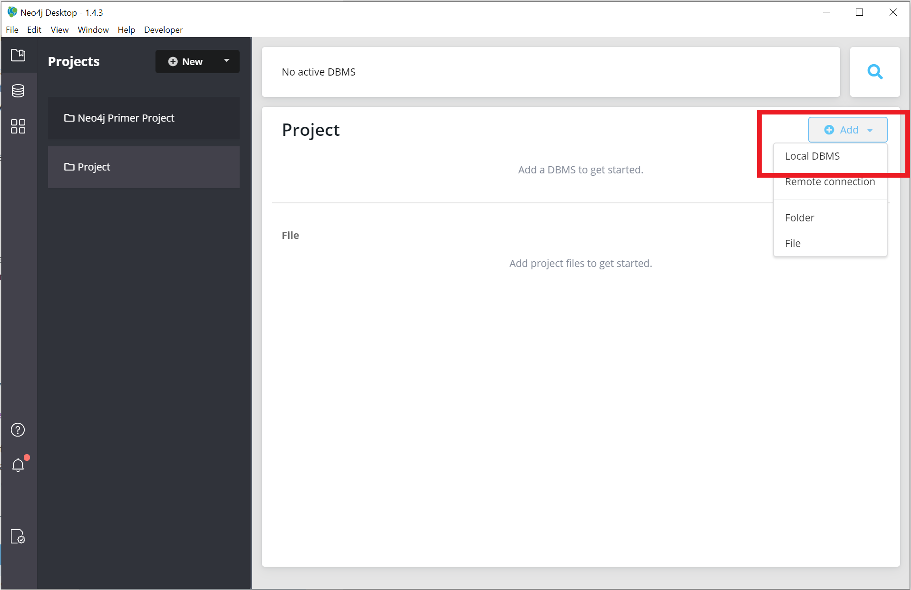
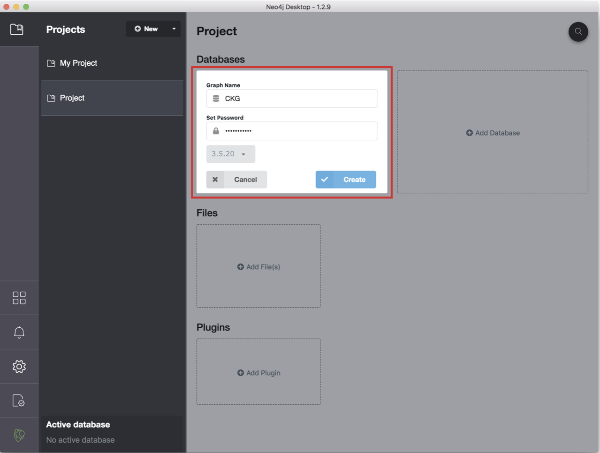
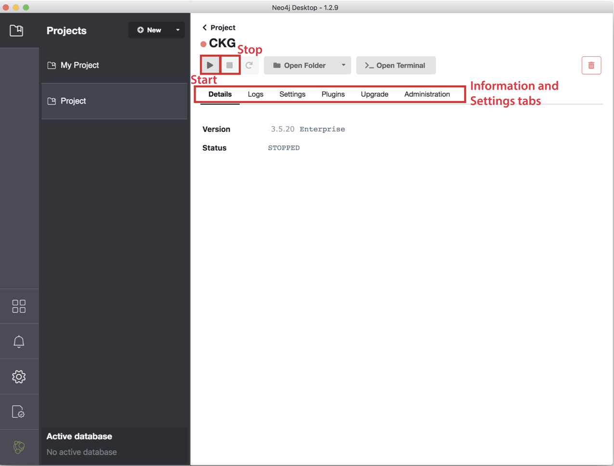
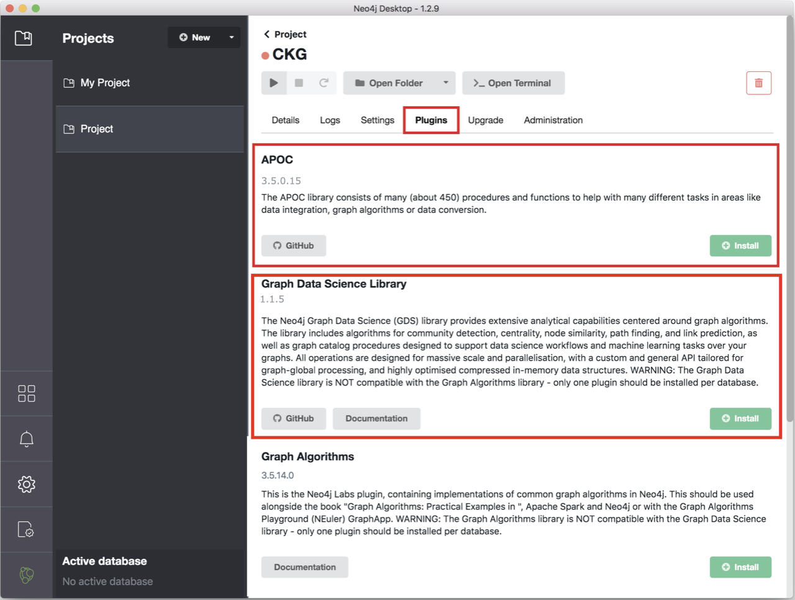
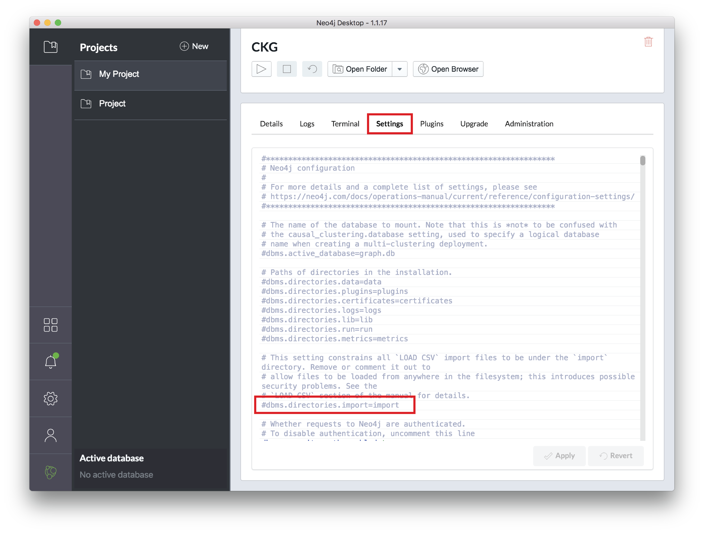

.. _Installing Neo4j:

.. include:: ../global.rst

Installing Neo4j
===================

Getting started with Neo4j is easy.

First download a copy of the Neo4j desktop version from the `Neo4j download page <https://neo4j.com/download/>`__.
The Community Edition of the software is free but a sign up is required.
Once the file has downloaded, you can install Neo4j by following the instructions automatically opened in the browser.

.. image:: ../_static/images/neo4j_app3.png
    :width: 32%

Open the Neo4j Desktop App and create a database by clicking :guilabel:`Add graph`, followed by :guilabel:`Create a Local Graph`, **choose database version**  |neo4j_version| using the password "NeO4J".
Now that your database is created:

1. Click :guilabel:`Manage` and then :guilabel:`Plugins`. Install "**APOC**" and "**Graph Data Science Library**".
#. Click the tab :guilabel:`Settings`, and comment the option ``dbms.directories.import=import`` by adding ``#`` at the beginning of the line.
#. Click :guilabel:`Apply` at the bottom of the window.
#. Start the Graph by clicking the play sign, at the top of the window.

If the database starts and no errors are reported in the tab :guilabel:`Logs`, you are ready go to!

