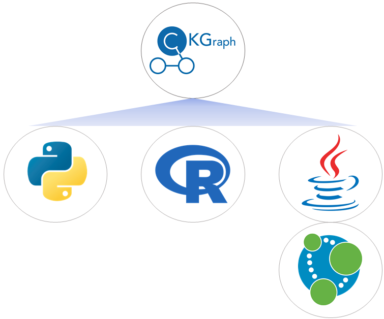
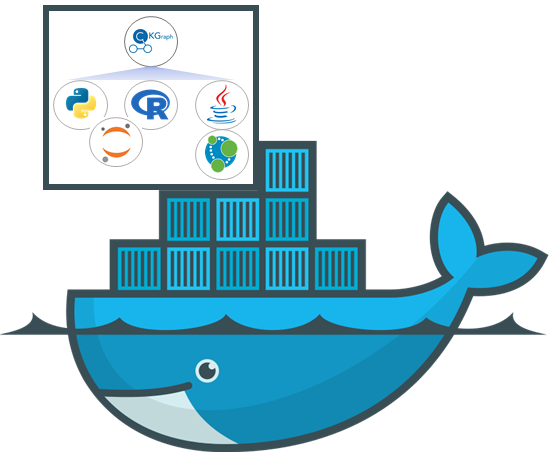

.. _Installation:

.. include:: ../global.rst

Installation
===============

The installation of CKG is a two step process:

1. **Installation of Neo4j**: The Neo4j graph database needs to be installed (https://neo4.com) and following the instructions here: :ref:`Installing Neo4j`

2. **Installation of CKG's python library**: installation of python and CKG's modules (:ref:`Installing CKG python library`)

The Clinical Knowledge Graph requires the installation of:

- Python

- R

- Java

- Redis (**Only Unix OS**)

The following instructions are optimised for operating systems MacOS and Linux. The installation on Windows systems is slightly different, please go to :ref:`Windows installation`.

To avoid possible compatibility issues caused by different Operating systems, python and R versions, we recommend to follow the instructions to build and use the :ref:`CKG Docker Container` instead (https://www.docker.com/).
By building the container and running it, you will get:

- Neo4j
- CKG
- JupyterHub

Initial Requirements
--------------------------

Python
^^^^^^^^^^^

To facillitate the installation of Python, we recommend to use the Miniconda installer:

1. Go to https://docs.conda.io/en/latest/miniconda.html and download the latest installer for your Operating System.

2. Install python following the instructions in the installation wizard

3. Open a terminal window to create a pyhton environment (https://docs.conda.io/projects/conda/en/4.6.1/user-guide/concepts.html#conda-environments) 

4. Run ``conda create -n ckgenv python=`` |qpython_version| (ckgenv is the name os the environment)

5. Activate the environment by running in the terminal window: ``conda activate ckgenv``

.. note:: To deactivate the environment run: ``conda deactivate``

R
^^^^^^^^^^^

Another essential package for the functioning of the Clinical Knowledge Graph is R.

Make sure you have installed **R version >=** |r_version|:

.. code-block:: bash

	$ R --version

And that R is installed in ``/usr/local/bin/R``:

.. code-block:: bash

	$ which R

To install the necessary R packages, simply initiate R (terminal or shell) and run:

.. code-block:: python

	install.packages('BiocManager')
	BiocManager::install()
	BiocManager::install(c('AnnotationDbi', 'GO.db', 'preprocessCore', 'impute'))
	install.packages(c('devtools', 'tidyverse', 'flashClust', 'WGCNA', 'samr'),
		dependencies=TRUE, repos='http://cran.rstudio.com/')
	install.packages('IRkernel')

.. note:: If you need to install R, follow `these <https://web.stanford.edu/~kjytay/courses/stats32-aut2018/Session%201/Installation%20for%20Mac.html>`__ tutorial.

Java
^^^^^^^^^^^

Before starting setting up Neo4j and, later on, the Clinical Knowledge Graph, it is very important that you have *Java* installed in your machine, including **Java SE Runtime Environment**.

Different versions of a Neo4j database can have different requirements. For example, Neo4j 3.5 versions require Oracle Java 8, while Neo4j 4.0 versions already require Oracle Java 11.
When using a new version of Neo4j, always remember to read the respective Operations Manual, and check for the software requirements.

To check if you already have **Java SE Development Kit** installed, run ``java -version`` in your terminal window. This should print out three lines similar to the following, with possible variation in the version:

.. code-block:: python

	java version "1.8.0_171"
	Java(TM) SE Runtime Environment (build 1.8.0_171-b11)
	Java HotSpot(TM) 64-Bit Server VM (build 25.171-b11, mixed mode)

Running ``/usr/libexec/java_home`` in the terminal should print out a path like ``/Library/Java/JavaVirtualMachines/jdk1.8.0_171.jdk/Contents/Home``. Otherwise, please follow the steps below:

1. Go to ``https://www.oracle.com/java/technologies/javase-downloads.html`` and download the version that fits your Neo4j version and OS requirements.

#. Install the package.

#. Run ``/usr/libexec/java_home`` in the terminal to make sure the *Java* package has been installed in ``/Library/Java/JavaVirtualMachines/``.

.. note:: You can also install Java from OpenJDK. Follow the instructions here: https://openjdk.java.net/install/index.html (make sure to choose the right Java version for your Neo4j installation)

.. warning:: In Mac OS, make sure you have **XQuartz** installed, as well as **Xcode**. For more information on how to install R on OS X, you can follow this `link <https://www.r-bloggers.com/installing-r-on-os-x/>`_.

Now that you are all set, you can move on and start with Neo4j.

Redis
^^^^^^^^^^^

This installation is only necessary for Unix Operating Systems (i.e MacOS, Linux).

edis is an open source (BSD licensed), in-memory data structure store, used as a database, cache, and message broker. CKG uses redis-server in combination with [Celery queues](https://docs.celeryproject.org/en/stable/getting-started/introduction.html) to run asynchronous tasks such as project creation or project report generation.

For more details on how to install Redis you can follow the instructions [here](https://redis.io/topics/quickstart).

The installation steps are:

1) Download Redis
   
.. code-block:: bash

	$ wget http://download.redis.io/redis-stable.tar.gz

2) Untar the downloaded file

.. code-block:: bash

	$ tar xvzf redis-stable.tar.gz

3) Install redis using `make`

.. code-block:: bash

	$ cd redis-stable
	$ make

When running CKG app, you will need to start first the Redis server with:

.. code-block:: bash

	$ redis-server
	