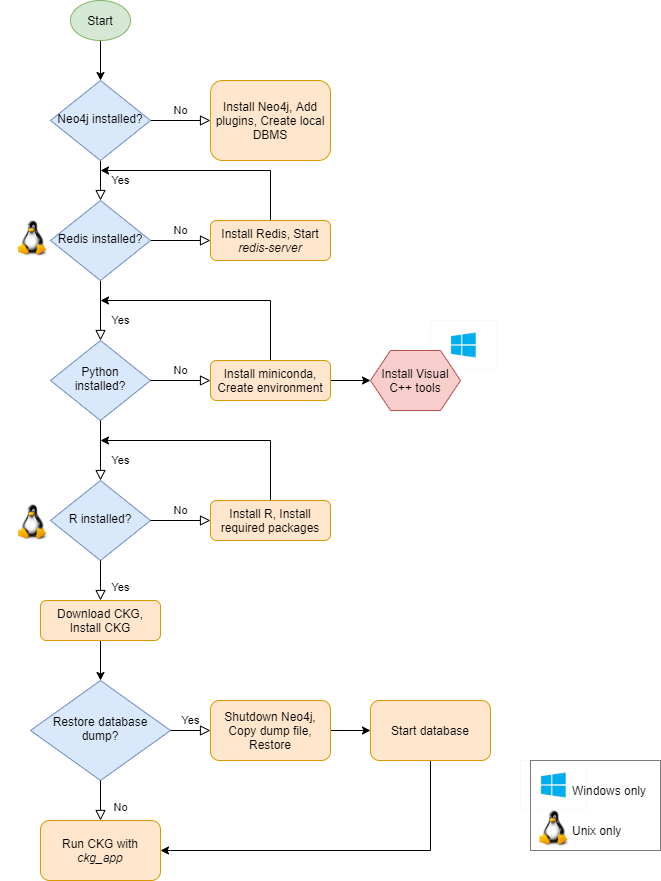

.. _Installation:

.. include:: ../global.rst

Installation
===============

The installation of CKG can be done in two different ways:

1. :ref:`ins_reqs`

2. :ref:`docker`

.. _ins_reqs:

Installation of Requirements
-----------------------------

This installation is a two step process:

1. **Installation of Neo4j**: The Neo4j graph database needs to be installed (https://neo4.com) and following the instructions here: :ref:`Installing Neo4j`
   
2. **Installation of CKG's python library**: installation of python and CKG's modules:

   - Python
   
   - :ref:`Installing CKG python library` 	

   - Optional:

     - R (**Only Unix OS** *for now*)

     - Redis (**Only Unix OS**)

.. image:: ../_static/images/installation_tech.png
	:width: 50%
	:align: center

You can follow this flowchart to make sure you have everything you need:

The installation instructions are optimised for operating systems MacOS and Linux. The installation on Windows systems is slightly different, please go to :ref:`Windows installation`.

Requirements
^^^^^^^^^^^^^

Python
"""""""

To facillitate the installation of Python, we recommend to use the Miniconda installer:

1. Go to https://docs.conda.io/en/latest/miniconda.html and download the latest installer for your Operating System.

2. Install python following the instructions in the installation wizard

3. Open a terminal window to create a pyhton environment (https://docs.conda.io/projects/conda/en/4.6.1/user-guide/concepts.html#conda-environments) 

4. Run ``conda create -n ckgenv python=`` |qpython_version| (ckgenv is the name os the environment)

5. Activate the environment by running in the terminal window: ``conda activate ckgenv``

.. note:: To deactivate the environment run: ``conda deactivate``

R
""""""

Some of the analysis in CKG use R libraries (i.e SAMR, WGCNA) so they require having R installed. This installation is optional and for now compatible only for Unix Operating Systems but we are working on making them available also for Windows. Hence, the installation of R is only required when installing CKG in a Unix OS.

Make sure you have installed **R version >=** |r_version|:

.. code-block:: bash

	$ R --version

And that R is installed in ``/usr/local/bin/R``:

.. code-block:: bash

	$ which R

To install the necessary R packages, simply initiate R (terminal or shell) and run:

.. code-block:: python

	install.packages('BiocManager')
	BiocManager::install()
	BiocManager::install(c('AnnotationDbi', 'GO.db', 'preprocessCore', 'impute'))
	install.packages(c('devtools', 'tidyverse', 'flashClust', 'WGCNA', 'samr'),
		dependencies=TRUE, repos='http://cran.rstudio.com/')
	install.packages('IRkernel')

.. note:: If you need to install R, follow `these <https://web.stanford.edu/~kjytay/courses/stats32-aut2018/Session%201/Installation%20for%20Mac.html>`__ tutorial.

.. warning:: In Mac OS, make sure you have **XQuartz** installed, as well as **Xcode**. For more information on how to install R on OS X, you can follow this `link <https://www.r-bloggers.com/installing-r-on-os-x/>`_.

Now that you are all set, you can move on and start with Neo4j.

Redis (**Only Unix OS**)
"""""""""""""""""""""""""

This installation is only necessary for Unix Operating Systems (i.e MacOS, Linux) since Windows 10 already comes with Redis installed.

edis is an open source (BSD licensed), in-memory data structure store, used as a database, cache, and message broker. CKG uses redis-server in combination with [Celery queues](https://docs.celeryproject.org/en/stable/getting-started/introduction.html) to run asynchronous tasks such as project creation or project report generation.

For more details on how to install Redis you can follow the instructions [here](https://redis.io/topics/quickstart).

The installation steps are (check Ubuntu installation below):

1) Download Redis
   
.. code-block:: bash

	$ wget http://download.redis.io/redis-stable.tar.gz

2) Untar the downloaded file

.. code-block:: bash

	$ tar xvzf redis-stable.tar.gz

3) Install redis using `make`

.. code-block:: bash

	$ cd redis-stable
	$ make

When running CKG app, you will need to start first the Redis server with:

.. code-block:: bash

	$ redis-server

.. warning:: In Ubuntu, the installation of Redis can be done just with:

	$ apt-get install redis-server

.. _docker:

Docker Image
--------------

To avoid possible compatibility issues caused by different Operating systems, python and R versions, we recommend to follow the instructions to build and use the :ref:`CKG Docker Container` instead (https://www.docker.com/).
By building the container and running it, you will get:

- Neo4j
- CKG
- JupyterHub

.. image:: ../_static/images/docker_container.png
	:width: 60%
	:align: center

