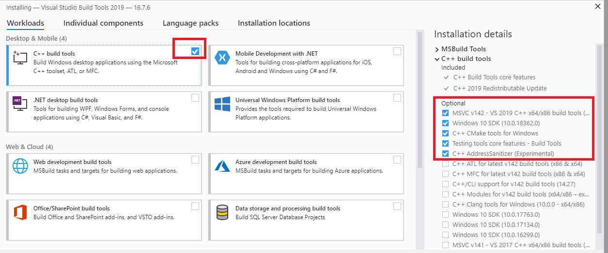

.. _Windows Installation:

.. include:: ../global.rst

Windows Installation 
=======================

In this section we describe how to install all the necessary requirements and set up the Clinical Knowledge Graph on a Windows operating system.

Java
-------

Similarly to MacOS and Linux, Windows will also need a **Java** installation (Java SE Runtime Environment and Java SE Development Kit).

Be aware that different versions of a Neo4j database can have different requirements. For example, Neo4j 3.5 versions require Oracle Java 8, while Neo4j 4.0 versions already require Oracle Java 11.
When using a new version of Neo4j, always remember to read the respective Operations Manual, and check for the software requirements.

By default Java should be installed on the Windows 10. If this is not your case, please follow this `tutorial <https://docs.oracle.com/javase/8/docs/technotes/guides/install/windows_jdk_install.html#A1097936>`__ to install it.

Neo4j
-------

The installation of Neo4j on Windows follows the same steps as in :ref:`Installing Neo4j`:

Python
----------

The installation of Python on Windows follows the same steps as in :ref:`Installation`:

Microsoft Visual C++ Build Tools
----------------------------------

Running python on Windows can sometimes result in the following error:

.. code-block:: python

	error: Microsoft Visual C++ 14.0 or greater is required.

To fix this error, you will need to download and install Microsoft `Build Tools for Visual Studio <https://visualstudio.microsoft.com/thank-you-downloading-visual-studio/?sku=BuildTools&rel=16>`__.

Once installed, click ``Workloads``, select all the packages available and install them. This will require several Gigabytes of disk space so, as an alternative and if your machine has limited space, you can install only ``C++ build tools`` under ``Workloads``, and ``Windows 10 SDK`` and the latest version of ``MSVC v142 - VS 2019 C++ x64/x86 build tools`` under ``Individual Components``.

The build tools allow Python packages to be built in Windows, from the command line (MSVC cl.exe module is used as a C/C++ compiler).

R
-------

Another essential package for the functioning of the Clinical Knowledge Graph is R.

You can check if an **R version >=** |r_version| is already installed by running:

.. code-block:: bash

	> r --version

If R is not installed in your machine, please follow `these tutorial <https://rstudio-education.github.io/hopr/starting.html>`__.

In order to simplify calling R from the command prompt, you can choose to add it to ``PATH`` and to the environment variables. To do so, follow the steps bellow:

1. Go to the Windows menu, right-click on :guilabel:`Computer` and click on :guilabel:`Properties`.

#. From the computer properties dialog, select ``Advanced system settings`` on the left panel. And from there, click on :guilabel:`Environment variables` button.

#. In the Environment variables dialog, click the :guilabel:`New` button in the top half of the dialog, to make a new user variable.

#. Give the variable name as ``R`` and the value is the path to the R executable, which is usually ``C:\Program Files\R\R-4.0.0\bin\R.exe``.

#. In the bottom half of the Environment variables dialog, find the variable ``Path``, select it and click :guilabel:`Edit`.

#. In the edit dialog window, add ``;`` to the end of the variable value followed by the R path used when creating the previous environmental variable.

#. Click :guilabel:`OK` to save, click :guilabel:`OK` and :guilabel:`OK` again to save the new variable and edit to ``Path``.

To run R from the command line, run:

.. code-block:: bash

	> R

All R packages can be installed by simply initiating R (command prompt or R shell) and running:

.. code-block:: python

	install.packages('BiocManager')
	BiocManager::install()
	BiocManager::install(c('AnnotationDbi', 'GO.db', 'preprocessCore', 'impute'))
	install.packages(c('devtools', 'tidyverse', 'flashClust', 'WGCNA', 'samr'), 
		dependencies=TRUE, repos='http://cran.rstudio.com/')
	install.packages('IRkernel')

.. warning:: If the install does not work (cannot write to library), run a new command prompt as administrator:

1. Go to the Windows menu, right-click on :guilabel:`Command Prompt` and select ``Run as administrator``.

In this new prompt, launch R and run the previous R install packages.