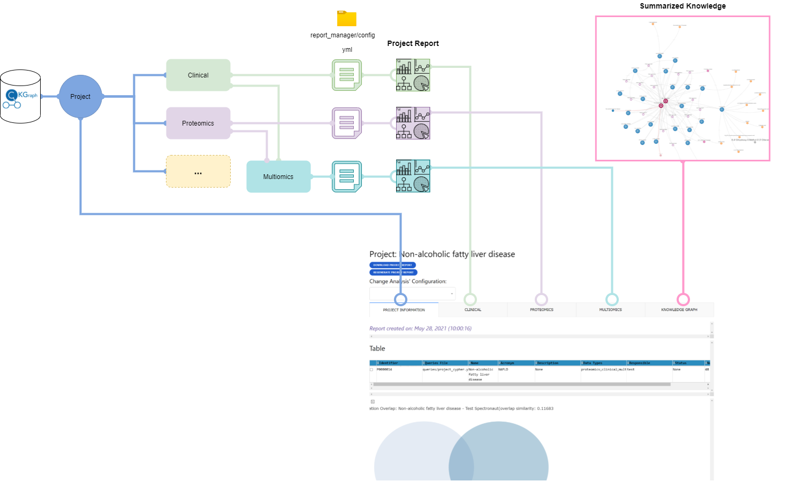
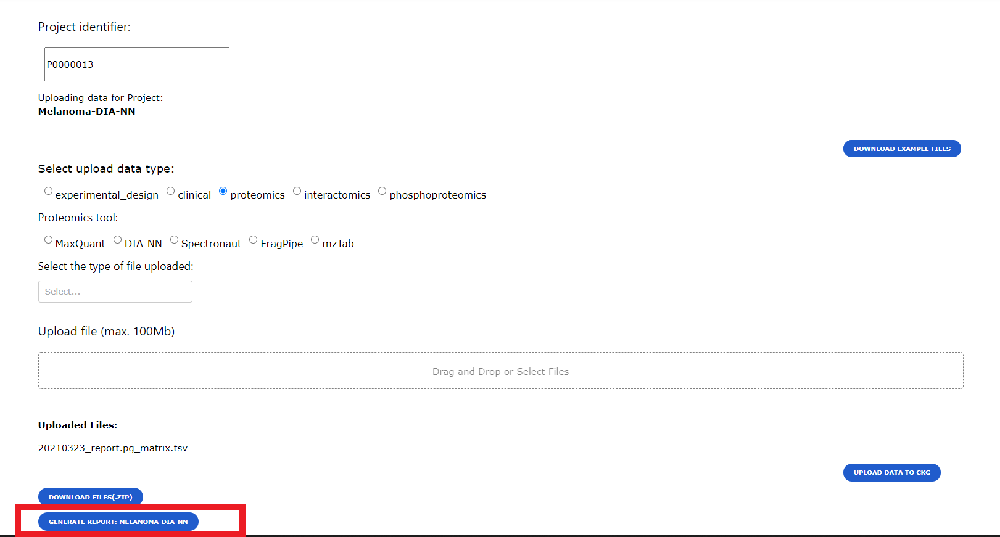
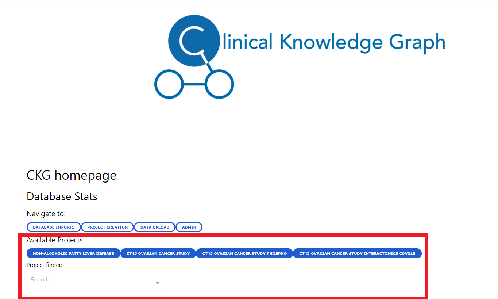
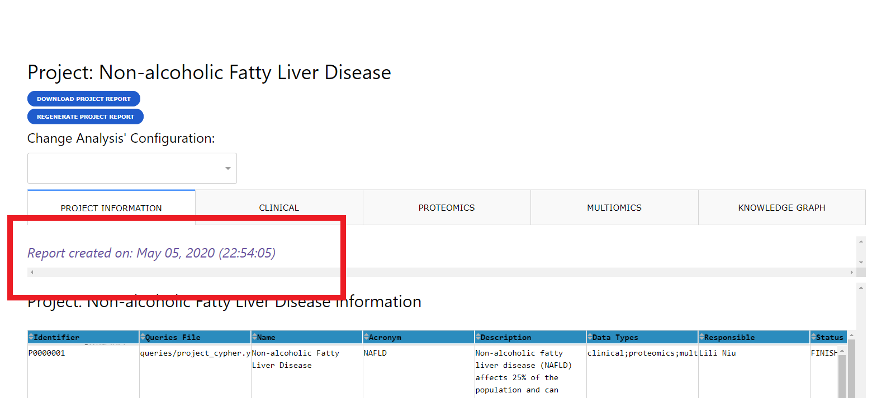
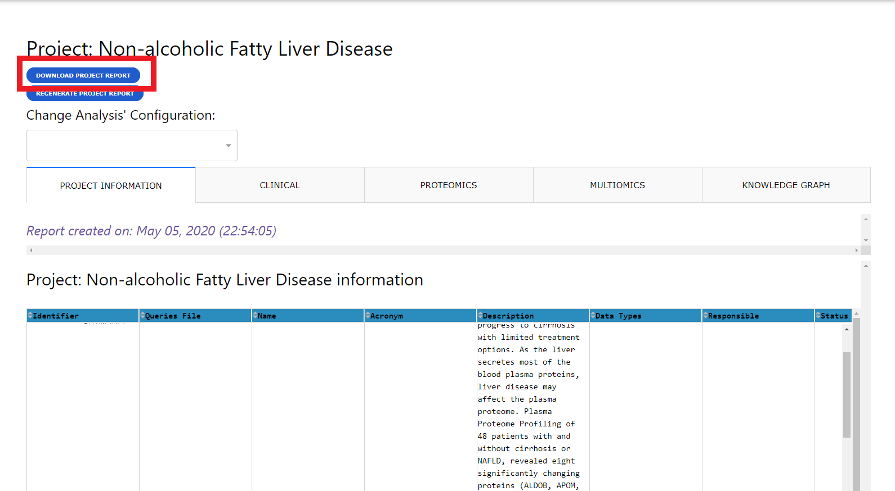
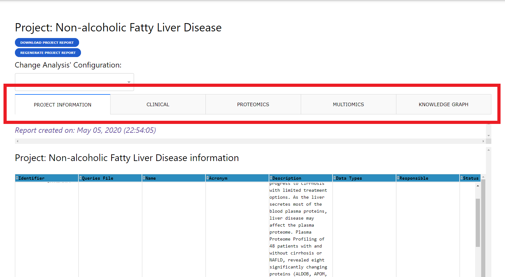
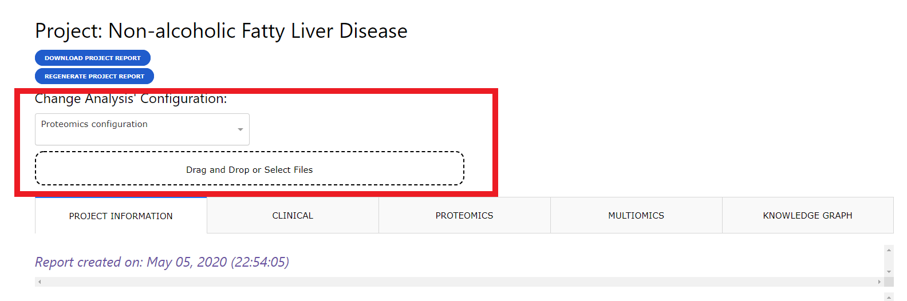
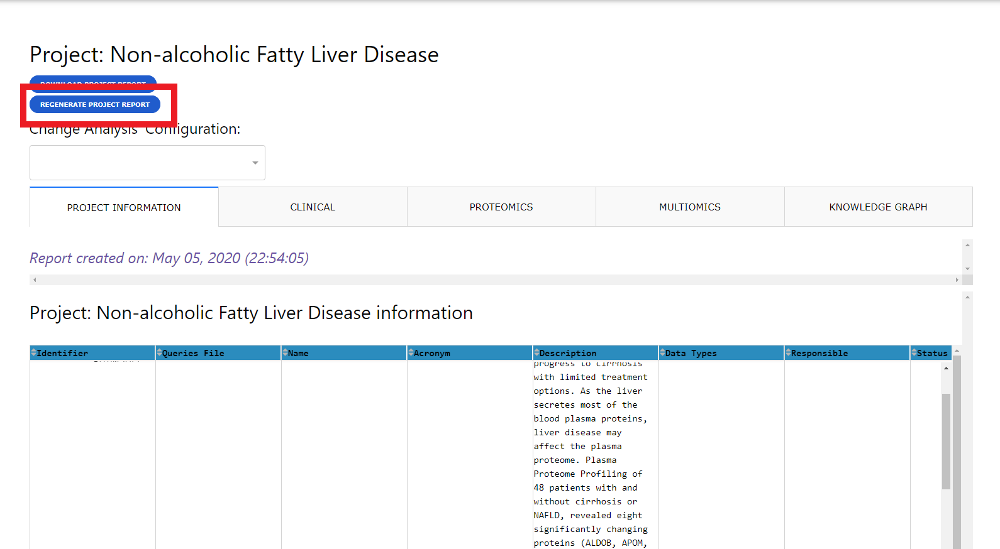

.. _Project report:

#######################
CKG Project Report
#######################

CKG can easily generate automated statistical reports using data linked to existing projects in the graph database.
These reports can be generated once the experimental data are uploaded. 

The sequence of analyses shown in the report is based on configuration files associated to each data type available.
CKG has default configuration files for the currently integrated data types - `clinical <https://raw.githubusercontent.com/MannLabs/CKG/master/ckg/report_manager/config/clinical.yml>`__, `proteomics <https://raw.githubusercontent.com/MannLabs/CKG/master/ckg/report_manager/config/proteomics.yml>`__, `phosphoproteomics <https://raw.githubusercontent.com/MannLabs/CKG/master/ckg/report_manager/config/phosphoproteomics.yml>`__ and `interactomics <https://raw.githubusercontent.com/MannLabs/CKG/master/ckg/report_manager/config/interactomics.yml>`__ datasets.

Users can build customized analytical pipelines by defining their own configuration files. Details on how to build these configuration files can be found in section :ref:`analysis conf`.

When a Report is generated, users will be able to access this report either through CKG app or programmatically for instance through a Jupyter notebook (see `Access Project Report notebook <https://ckg.readthedocs.io/en/latest/notebooks/recipes/Access%20Project%20Report.html>`__).

CKG app Report
===============

To generate a report for a specific project all the data for the project needs to be uploaded into the Knowledge Graph database. When uploading data into CKG through the Data Upload page (see :ref:`Upload Data`), users will be given the option to generate the report.

Users will be able to generate reports for the available projects or have access to the already generated reports from the Home page where they will see links to several projects in the database or they will be able to search for a specific project in a dropdown menu and by selecting a project, a button to generate/access the project report will be created.

When accessing a report, if the report was not previously generated CKG will run all the default analyses defined in the configuration files (:ref:`analysis conf`). If the report was already generated, CKG will just load the latest report and show the date when it was created.

Reports can be downloaded using the download button. This will generate a compressed folder (zip) with all the analysis and visualization generated by CKG. Also, the download will include the configuration files used to generate those results, which can be reused to reproduce or replicate the project.

.. note:: Network visualizations are stored in 3 different formats: json, node and edge tables and GML (compatible with Cytoscape).

Report structure
^^^^^^^^^^^^^^^^^^

A project report is divided into multiple tabs with one with some project information and other with analysis results for each dataset available (i.e. clinical, proteomics).

Project Info Tab
"""""""""""""""""

The project info tab contains details about the project that were specified upon creation and a similarity analysis comparing it with other existing projects in the Knowledge Graph.
This comparison is at the proteomics level and measured with 2 distinct similarity scores:

- **Correlation**: Pairwise Pearson correlation coefficient (cutoff=0.5)
  
- **Overlap**: Jaccard index 

Further, for the projects found most similar (correlation), CKG will provide a network showing if these projects are somehow connected, for instance, if they study the same disease or the same tissue. 

Dataset Analysis Tabs
""""""""""""""""""""""

There will be a tab for each of the data types associated with a project. In these tabs you will see the results from the analysis specified in the configuration files.
Initially these tabs will present the results defined in the default analytical pipelines but users can regenerate the reports by providing customized configuration files for one or several data types.

Multiomics Tab
""""""""""""""""

In the previous section we described how dataset independent analyses are shown in the report. However, CKG also analyzes different data types combined and shows the results in the Multiomics tab.
Currently, CKG can analyze clinical and proteomics data together in a multi-correlation network analysis or using Weighted Gene Co-expression Network Analysis (WGCNA). These analysis need to be defined in a configuration file as well (:ref:`Multiomics Data conf file`).

Knowledge Graph Tab
""""""""""""""""""""

CKG will add another tab to the report where it will try to summarize all the resul ts obtained in the independent and multiomics analysis. CKG will connect relevant hits (clinical variables, proteins, etc) in the analyses and connect them to knowledge in the graph database to build a project-specific knowledge graph (diseases, drugs, protein complexes, etc.).
Then, in order to summarize the results to make them easier to interpret, CKG uses `betweenness centrality <https://en.wikipedia.org/wiki/Centrality#Betweenness_centrality>`__ to identify the most relevant nodes in the generated network. The summarization is visualized as network or a Sankey plot.

.. image:: ../_static/images/reports_knowledge_graph.png
    :align: center

CKG offers more summarization options based also on the concept of centrality but also other algorithms such as `PageRank <https://en.wikipedia.org/wiki/PageRank>`__. For examples of how to use this summarization algorithms check the notebook recipes: `Annotate Proteins with CKG Knowledge <https://ckg.readthedocs.io/en/latest/notebooks/recipes/Knowledge%20from%20list%20of%20proteins.html>`__ and `Annotate drugs with CKG Knowledge <https://ckg.readthedocs.io/en/latest/notebooks/recipes/Knowledge%20from%20list%20of%20drugs.html>`__.